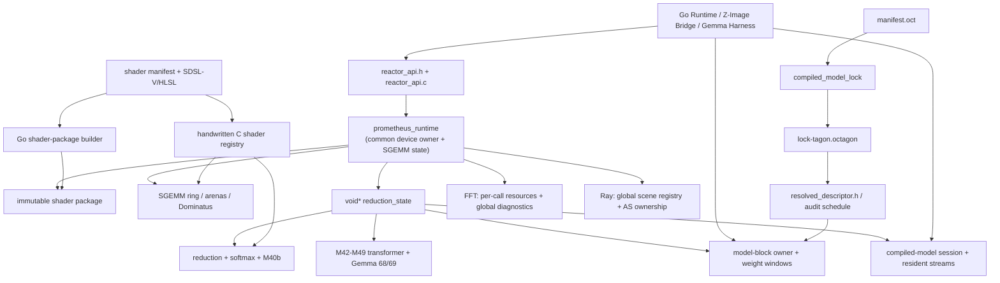

# Prometheus full architecture audit

Date: 2026-07-23

Audited checkpoint: `1f6e0b7d` (`prometheus: checkpoint live Gemma raw-score execution`)

Disposition: audit and recommendation only; no production source changed

## Audit method and authority

This report treats `PROMETHEUS_G4_E2B_M1_REVIEWER_HANDOFF.md` and the complete
`PROMETHEUS_G4_E2B_M1_TEXT_LAYER0.md` as the current execution authority. It also
uses the DVT-2 handoff, pre-M0 architecture report, later milestone reports,
`internal/prometheus/native/ARCHITECTURE.md`, `docs/DVT2_ARCHITECTURE.md`,
`docs/EVT2_LOCAL_PAYLOADS.md`, and
`docs/PROMETHEUS_VULKAN_PLATFORM_CONTRACT.md` as historical and contractual
evidence. The native audit was evaluated against `primer/vulkan-primer.md` and
`primer/cpp-primer.md`.

The inspection covered all 24 manifest-listed production C translation units,
their public and internal headers, 51 native test/harness files, the Go runtime
and both dynamic loaders, Z-Image and Gemma Go packages, the Z-Image bridge,
compiled-model lock generator, model manifest/lock/generated projections,
shader source manifest and package builder/loader, SDSL-V/HLSL/generated shader
surfaces, build manifests/scripts, tracked reports, and tracked artifacts.
Counts below are line-oriented PowerShell measurements and are evidence, not
quality scores. “Observed” means directly present in source. “Inference” is
explicitly labelled.

## 1. Executive verdict

**Verdict: option 5, with option 2 dominant and option 3 still visible.**
Prometheus has a credible high-level architecture and a proven execution core,
but its internal state ownership has not caught up with what the system became.
It is not a failed architecture and does not warrant a wholesale rewrite.

The stable system Prometheus has actually become is:

> one Vulkan runtime/device owner with an immutable, content-addressed shader
> package; mature SGEMM, reduction, FFT, and ray-query operation families; a
> production Z-Image compiled-block executor with bounded residency, atomic
> rebinding, prefetch, and session streams; and a newer Gemma execution slice
> implemented through the older numbered transformer machinery.

Direct answers:

| Question | Verdict |
|---|---|
| Is the high-level architecture credible? | **Yes.** The compiled-model/package thesis, bounded device residency, immutable package identity, generated lock projection, and direct Vulkan execution are validated by accepted Z-Image and Gemma evidence. |
| Which boundaries are sound? | Shader package immutability and content addressing; the lock-to-generated-descriptor direction; `prom_vk_buffer`; model weight-window commit semantics; `prom_compiled_model_session_state` as a concept; explicit resident stream roles; SGEMM physical-slot quarantine; ray-query scene ownership; CPU/numerical authorities. |
| Which boundaries are missing or confused? | Common runtime versus SGEMM ownership; reduction versus transformer/model/Gemma ownership; storage slot versus content generation versus role pin; weight storage versus active binding versus validation snapshot; model plan versus handwritten dispatch procedure; package manifest versus static registry; native ABI versus duplicated Go/C declarations. |
| Dominant problem? | **Both, led by technical debt around missing ownership boundaries.** The architecture is viable; several localized structures force broader coupling than the architecture requires. |
| What should be consolidated? | Vulkan device/session services, buffer/upload primitives, operation-slot lifecycle, weight binding transactions, package/registry facts, platform ABI declarations, and common live-device test setup. |
| What should be refactored in place? | `prometheus_runtime`, `prom_reduction_runtime_state`, `prom_reduction_slot`, model-block/session embedding, SGEMM’s long control procedures, and semantic naming of M42–M49 concepts. Preserve numerical kernels and proven dispatch order. |
| Does anything warrant replacement? | No numerical or execution subsystem does. The handwritten lock projection and duplicated registry/loader declarations should eventually be **regenerated from one authority**, which is replacement of projections, not replacement of the runtime. |
| Another reactor before consolidation? | **No.** FFT, reduction, and ray query already prove the pressure. A further operation would copy lifecycle machinery or learn SGEMM internals. |
| More handwritten model execution before a compiler boundary? | **No.** Gemma already requires model-specific ABI and procedural orchestration in general runtime state. |
| Smallest safe first pass? | Freeze vocabulary and add characterization only: map semantic names to numbered concepts, snapshot lifecycle transitions (including the exact `-7406` reproduction), validate generated topology, and record current consumers. No movement or behavioral correction in that pass. |

The proven kernels, package format, device residency, Z-Image owner/session
contracts, and accepted numerical results should be preserved. The target is a
smaller number of authoritative owners, not a new framework.

## 2. Proven architecture versus unproven assumptions

| Status | Claim | Evidence |
|---|---|---|
| Proven | Z-Image executes a deterministic accepted image through Prometheus. | Current reviewer handoff; DVT-2 handoff; Z-Image bridge calls `compiled_model_owner_*`, session composition, 30 retarget/execute operations, then final audit readback. |
| Proven | One assembly is reused across 30 parameter sets. | `models/zimage-turbo/manifest.oct`; `resolved_descriptor.h`; `reactorDLL.runMain` loops 30 layers over one `ownerID`. |
| Proven | Bounded model VRAM, persistent activation streams, atomic rebind, and dual-window prefetch work. | `prom_model_block_state.weights`, `pending_weights`, `prefetch_weights`; `prom_reactor_runtime_compiled_model_prefetch_impl`; accepted DVT-2 evidence. |
| Proven | Package artifacts are immutable and content addressed. | `shaderpackage/package.go` writes `objects/sha256/<digest>.spv`; `reactor_shader_package.c` validates manifest tables, sizes, digests, and SPIR-V before module creation. |
| Proven | Gemma kernel 69 reads resident kernel-68 Q/K and is correct in fresh sessions. | `prom_reactor_runtime_gemma4e2b_m1_attention_scores`; accepted 1,800-score Q-first/K-first evidence. |
| Proven | The same-session failure occurs at required M46 weight validation before positional dispatch. | `reactor_api.c` prepares M46 then copies returned generation/hash into `prom_m49a_m46_request`; `prom_reactor_runtime_m49a_execute_m46` rejects at the state comparison before slot acquisition/dispatch. |
| Proven | Controller overhead is not the full-image bottleneck. | Accepted profiling accounts for 99.941% and exonerates controller, scheduling, recording, and descriptor update as primary causes. |
| Unproven | “Reactor” is a uniform reusable execution abstraction. | FFT, reduction, SGEMM, model execution, and ray query share a device and some buffer helpers but own different rings, registries, descriptors, and submission logic. |
| Unproven | Generated model facts are fully authoritative and internally consistent. | `tools/compiled_model_lock.mainTransformerLockBlocks` initializes every non-final successor to `MainTransformer1`; 29 lock records therefore repeat that successor. Execution uses the bridge loop and generated parameter table, not this topology field. |
| Unproven | Linux is equivalent to Windows. | Linux source exists, but the accepted handoff explicitly leaves Linux unclaimed. |
| Unproven | One generic plan can cover ray tracing and compute. | Ray tracing owns BLAS/TLAS, device addresses, scene mutation/commit, and batch trace state; these semantics are not compute-buffer dispatch semantics. |
| Inference | A compact compiled execution plan can serve both models. | Z-Image supplies enough repeated structure to justify a plan boundary, but Gemma has no lock/descriptor projection yet. The common semantic IR is not demonstrated. |

Accepted numerical and performance evidence is not reopened by this audit.
Internal ownership weaknesses do not contradict those external contracts.

## 3. Physical implementation inventory

### Tracked `internal/prometheus` inventory

| Area | Files | Lines |
|---|---:|---:|
| `DevelopmentReport` | 594 | 193,463 |
| `native` | 184 | 109,681 |
| `.octmake` | 22 | 35,719 |
| `shaders` | 134 | 10,986 |
| root Go/build files | 16 | 4,449 |
| `zimage` | 24 | 3,175 |
| `models` | 5 | 1,190 |
| `shaderpackage` | 2 | 567 |
| `gemma4e2b` | 2 | 345 |
| `cooperative` | 2 | 229 |
| `ValidationReport` | 1 | 183 |
| **Total** | **986** | **359,987** |

The report area alone contains 216 Markdown reports and 378 artifact files.
This is useful forensic history but is physically dominant over the runtime.

Native extension totals outside reports include 26 C files (42,186 lines), 49
C++ files (31,261), and 106 headers (37,841). The 24 production files listed by
`native_manifest.json` total approximately 48,700 lines. The largest are:

| File | Lines | Approx. function starts | Architectural concentration |
|---|---:|---:|---|
| `reactor_vulkan_transformer.c` | 13,442 | 178 | M42–M49 planning, resources, recording, Gemma kernels 68/69 |
| `reactor_vulkan_sgemm.c` | 8,534 | 175 | device creation, runtime registry, SGEMM planning/execution, async/ring, telemetry |
| `reactor_vulkan_model_block.c` | 6,006 | 114 | Z-Image blocks, sessions, streams, owner, retarget, prefetch, audit |
| `reactor_vulkan_fused_reduction.c` | 2,602 | 57 | reduction plan/ring plus shared slot allocator and M40b |
| `reactor_dominatus_sgemm_adapter.c` | 1,671 | 35 | SGEMM policy/telemetry integration |
| `reactor_numerical_research.c` | 1,318 | 47 | numerical comparison/research support |
| `reactor_vulkan_ray_query.c` | 1,185 | 45 | scene registry, AS build, tracing |
| `reactor_api.c` | 727 | 87 | ABI forwarding plus substantive Gemma composition |

Large lexical-span estimates (declaration to next detected declaration, not
brace-perfect sizes) identify concentration rather than automatic split points:
`prom_reactor_runtime_sgemm_impl_with_variant` is about 1,681 lines,
`vk_runtime_init` 1,091, `prom_reactor_runtime_m48_execute_stack` 837,
`prom_m45_execute_composed_core` 762, and
`prom_reactor_runtime_sgemm_policy_diagnostics_fill` 642.

State concentration is more important than file length:

| Type | Source span | Approx. field declarations | Finding |
|---|---:|---:|---|
| `prometheus_runtime` | 220 lines | 207 | Common device owner and SGEMM controller/state are one type. |
| `prom_model_block_state` | 182 | 165 | Identity, telemetry, buffers, pipelines, active/pending/prefetch weights, and owner state are one record. |
| `prom_reduction_runtime_state` | 158 | 151 | Reduction, M40b–M49, Gemma, model block, compiled session, and shared slots. |
| `prom_reduction_slot` | 92 | 86 | Reduction, attention, transformer-stack, Gemma, readback, and audit buffers. |
| `prom_compiled_model_session_state` | 29 | 27 | Relatively cohesive lock/session/stream state. |

Other measured indicators:

- `reactor_api.h` declares 84 unique exported functions and 169 numeric detail
  constants using only 150 distinct values.
- The exact range `-6901` through `-6919` is duplicated between model-block and
  ray-query detail families.
- A scan of the 24 production C files finds 815 unique `prom_m*`, `prom_p*`, or
  `prom_px*` milestone-prefixed identifiers. The public/internal API header has
  442 milestone-like identifiers.
- The two Go dynamic loaders differ by only 51 additions and 59 deletions over
  roughly 630 lines each; almost all C ABI structs and call wrappers are
  duplicated.
- Native tests contain 461 `FACT(` registrations and 240 `SKIP(` call sites in
  51 files. The Go area has 56 test functions and 9 `t.Skip*` sites.
- The shader source manifest declares 69 production assets, 11 experimental
  assets, and 18 compute implementations. Of 80 assets, 75 are `.sdslv`, two
  `.hlsl`, one base64 SPIR-V, and two historical/no-extension sources.
- There are 59 tracked generated-like headers; `native_manifest.json` lists 32
  under `generated_headers`. The build authority is therefore incomplete as an
  inventory even though compilation can still name headers transitively.
- `native_manifest.json` has 24 production and 47 ordinary native-test source
  entries. `Make.oct` retains explicit M5b/M6a experimental variants.
- `internal/prometheus/.octmake` is tracked: 22 files, including a 32,863-line
  state file, a 2,205-line trace, and 20 failure records. The repository also
  tracks 252 files below top-level `out/` and one `.pyc`. These are generated
  debris, not runtime source.

Conditional compilation is concentrated rather than pervasive:
`reactor_vulkan_model_block.c` has 44 conditional-directive lines,
`reactor_vulkan_sgemm.c` 36, and ray query 6. Transformer includes are the
largest production concentration (17). This argues for separating ownership,
not for scattering platform branches.

## 4. Actual dependency and ownership map



The dependency problem is not an include cycle alone; it is bidirectional
knowledge:

- `reactor_vulkan_sgemm.c` owns the common handle and exposes services.
- `reactor_vulkan_fused_reduction.c` lazily creates the attached state and owns
  the slot allocator used by transformer/Gemma.
- `reactor_vulkan_transformer.c` mutates fields in that “reduction” state.
- `reactor_vulkan_model_block.c` embeds both model owner and compiled session in
  the same state and calls reduction-owned resource helpers.
- Cleanup of the attached state knows how to tear down transformer and
  model-block resources.

### Ownership table

| Concept | Current authority and files | Mutable state / other writers | Lifetime and invariant | Boundary |
|---|---|---|---|---|
| Vulkan instance/device/queues | `prometheus_runtime`; `reactor_vulkan_sgemm.c` | Created/destroyed only by common runtime; exposed through `prom_vk_runtime_services` | Runtime handle; package and attached states must die first | Sound ownership, wrong SGEMM-centric home/name |
| Runtime handle registry | `g_active_handles` in `reactor_vulkan_sgemm.c` | Global lock; create/destroy | Process-global; at most tracked live handles | Explicit but global |
| Shader package | `prom_shader_package`; Go builder and C loader | Immutable after open; module creation increments open count | Runtime lifetime; manifest/table/digest/SPIR-V valid | Sound |
| Static shader metadata | `reactor_shader_registry.c` | Compile-time tables | Binary lifetime; IDs must match package | Duplicate authority with source/package manifest |
| SGEMM execution | `prometheus_runtime`, SGEMM C, batch, Dominatus | Ring, async tasks, typed arenas, caches, policy diagnostics | Runtime lifetime; slot generations and quarantine protect reuse | Cohesive operation, entangled with device owner |
| Reduction execution | `prom_reduction_runtime_state` and `prom_reduction_slot` | Reduction and transformer files both mutate | Attached runtime lifetime; one shared ring | Disputed/overloaded |
| Transformer/Gemma weights | Scalar/array generation/hash fields in `prom_reduction_runtime_state` | Prepare calls write; execute calls read; API copies snapshots | Last prepared value per numbered family | Implicit singleton authority |
| Gemma Q/K retained roles | Six `gemma4e2b_m1_rope_*` fields; transformer plus reduction slot allocator | M49 pins, score consumes/releases, allocator reads | From successful positional dispatch through score completion | Explicit fields, no typed lease object |
| Z-Image model owner | `prom_model_block_state` in model-block C | create/upload/rebind/prefetch/activate/execute | One physical owner, active and one inactive complete window | Proven semantics, oversized record |
| Compiled session streams | `prom_compiled_model_session_state.streams` | capture/compose/reset/execute | Session lifetime; lock identity and generation checks | Sound concept, embedded in wrong state |
| Z-Image host orchestration | `tools/prometheus_zimage_bridge` | Separate process-global session registry; 30-layer Go loop | Bridge session lifetime | Real consumer, duplicates runtime/session vocabulary |
| Ray scenes | `g_ray_query_scenes` and per-scene services | Scene API under process-global lock | Until explicit destroy/runtime destroy-all | Operation-specific and appropriate, but registry is separate |
| FFT diagnostics | `g_fft_diag_slots[32]` | FFT calls and runtime destroy | Runtime-handle keyed global cache | Small but another handle registry |
| Numerical authority | Go canonical references, native CPU references, checkpoint loader | Test/harness only | Test/evidence lifetime | Deliberately separate and sound |

Hidden state is concentrated in three globals (`g_active_handles`,
`g_ray_query_scenes`, `g_fft_diag_slots`) and the opaque attached
`reduction_state`. The principal “sacks” are `prometheus_runtime`,
`prom_reduction_runtime_state`, `prom_reduction_slot`, and
`prom_model_block_state`.

## 5. Lifecycle and identity ownership table

All lifecycle-bearing fields in the active runtime path are ordinary
`uint32_t`/`uint64_t` values. Their names provide intent, but their types do not
prevent a slot generation, content generation, binding generation, hash,
session ID, or replay ID from being interchanged.

| Lifecycle class and exact fields/types | Meaning and owner | Writers / readers / transitions | Assessment and related rejection |
|---|---|---|---|
| Model/package identity: lock `ManifestIdentity`, `ModelSemanticIdentity`, `ProductionExecutionIdentity`, `AuditProfileIdentity`; descriptor `PROM_ZIMAGE_TURBO_LOCK_ID`; API `lock_identity`, `model_contract_identity`, `shader_portfolio_identity`, `precision_policy_identity`, `capability_route_identity`, `execution_plan_identity`, `canonical_authority_identity`, `internal_abi_identity`, `memory_plan_identity` | Immutable data/package facts; lock generator and generated descriptors own them | Created at build/generation; read at session/block create and evidence; never mutated in-session | Necessary but represented repeatedly; strong value semantics, weak C types |
| Package artifact identity: `Artifact.Digest` in Go and `prom_package_artifact.digest[65]` in C | SPIR-V content identity | Builder computes; loader validates before module creation | Sound content identity; package errors are typed internally |
| Weight data identity: `prom_model_block_weight_resource.content_identity`, `.layout_identity`; `prom_transformer_parameter_resource.hash`; `m42_weight_hash`, `m43_weight_hash`, `m44_wo_hash`, `m46_weight_hash`, `m47_weight_hash`, `m48_initial_hash`; request/result `required_weight_hash`, `exact_source_hash`, `weight_hash` | Hash of immutable content or caller-captured validation snapshot | Prepare/upload computes and stores; API copies; execute compares | Necessary, but “hash” and “identity” are not consistently distinguished |
| Active weight version: model `binding_generation`, `descriptor_generation`, `prefetch_generation`, `prefetch_descriptor_generation`; transformer `m42_weight_generation`, `m43_weight_generation`, `m44_wo_generation`, `m46_weight_generation`, `m47_weight_generation`, per-layer `generation` | Version of storage/binding currently active | Upload/retarget/prefetch activation writes; execute/plan reads; newer prepare invalidates prior snapshot | Multiple real concepts share one integer vocabulary |
| Source-captured validation snapshot: request `required_*_generation`, `required_*_hash`, `source_output_generation`, `required_output_generation`, `observed_weight_generation`, `requested_weight_generation` | What a planned operation expects to remain current | API/planner captures; execute validates; no owner object preserves the pair | Missing typed snapshot; stale detail families protect it |
| Activation/content generation: `resident_input_generation`, `output_generation`, `m42_resident_x_generation`, `m43_resident_x_generation`, `m48_initial_generation`, `prepared_image_generation`, `prepared_context_generation`, `joint_generation`, `joint_image_generation`, `joint_context_generation`, `evaluation_generation`, stream `.generation` and `.producer_output_generation` | Logical content version, independent of physical storage | Capture/compose/execute write; following stage validates; reset invalidates evaluation | Necessary and generally explicit; type permits confusion with storage generations |
| Physical slot identity: `prom_reduction_slot.slot_id`, `.generation`, `.state`, `.logical_request_id`; SGEMM slot equivalents plus `submission_sequence`; async task `physical_slot_id`, `physical_slot_generation`, task `generation`, `public_task_id` | Storage/submission lease and recycle epoch | Allocator increments generation, state machine advances, completion/quarantine releases | Sound concept in SGEMM; reduction version is overloaded by unrelated operations |
| Retained role/pin: `gemma4e2b_m1_rope_q_slot_id`, `_q_slot_generation`, `_q_valid`, K equivalents | Lease preventing Q/K slot recycling | M49 successful direct-RoPE path pins; reduction allocator reads; kernel 69 validates; score success clears valid bits | Real invariant represented as six parallel scalars; release is success-path procedural |
| Buffer range identity: `prom_device_buffer_view.buffer`, `offset`, `byte_length`, `owning_device`, `owning_lifetime_id`, `owning_slot_id`, `owning_slot_generation`, layout/access fields | Physical storage view plus owner epoch and range | Producer fills; planners validate overlap/lifetime; consumers bind | Useful shared mechanism; `owning_lifetime_id` is semantically broad |
| Arena validity: `prom_typed_arena.role`, `.generation`, `.artifact_key_valid`, `.owner_slot_id`, `.valid`, `.in_flight`, epoch counters | SGEMM reusable storage and cached layout/content suitability | SGEMM policy and slot adapter mutate; diagnostics read | Valuable SGEMM mechanism, not yet general runtime storage |
| Session/owner identity: `session_id`, `next_session_id`, `active_block_id`, block `block_id`, `next_block_id`, bridge handle and `ownerID` | Object identity | Create allocates; destroy clears; APIs validate equality | Necessary, opaque integers; one in-process instance is embedded in attached state |
| Replay/operation identity: `replay_identity`, `m1b_prefix_replay_identity`, plan `command_plan_replay_id`, `aggregate_replay_id`, `head_replay_id`, `next_logical_request_id`, M49 execution index | Deterministic plan/content identity or request ordering | Plan builders hash; runtime counters allocate; diagnostics compare | “Replay” mixes immutable plan identity and operation occurrence |
| Validity/quarantine: `created`, `weights_uploaded`, `output_valid`, `audit_valid`, `quarantined`, stream `.valid`, `evaluation_complete`, slot state enums, SGEMM `physical_completion_confirmed`, package/table validation | Admissibility and safe reuse | Create/execute/failure/reap/reset | Necessary; many booleans allow invalid combinations that a state enum could exclude |
| Lease telemetry only: API `p13_m10_lease_*`, `p15_future_lease_*`, selector visible generations, boundary generations | SGEMM policy observation/prediction, not model resource ownership | Dominatus/diagnostics | Keep operation-specific; do not confuse with actual resource leases |

Creation, invalidation, and release are therefore implemented, but split across
value fields and call order. Data identity, storage identity, a validation
snapshot, and a lease are independently necessary. They should remain distinct
and receive distinct internal types.

### The `-7406` diagnostic specimen

Observed flow:

1. `prometheus_reactor_runtime_gemma4e2b_m1_attention_scores` constructs two
   `PrometheusGemma4E2BM1HeadRmsNormRopeRequest`s in Q-first or K-first order.
2. `prometheus_reactor_runtime_gemma4e2b_m1_head_rmsnorm_rope` calls
   `prom_reactor_runtime_m46_prepare_weight`.
3. Prepare hashes the weight, rejects non-increasing generations, waits all
   shared slots, uploads, then writes the singleton
   `state->m46_weight_generation/hash/model_width` and returns the same
   generation/hash.
4. The API copies those return values into
   `prom_m49a_m46_request.required_weight_generation/hash`.
5. `prom_reactor_runtime_m49a_execute_m46` recomputes/validates input, ensures
   pipelines, then compares the request snapshot against the singleton fields.
   A mismatch returns `PROM_M46_DETAIL_STALE_WEIGHT_GENERATION` (`-7406`) before
   slot acquisition or positional dispatch.
6. Successful positional execution pins a physical slot by role with
   slot ID/generation/valid scalars. Kernel 69 validates those pins, acquires a
   third slot, dispatches, reads back, and clears both valid flags.

The accepted trace establishes that the second M46 prepare succeeds and the
immediately following validation disagrees. Source inspection did not prove
which writer or transition changes the compared value in the failing session,
and this report does not assert one.

Classification: it is a **localized implementation defect**, and also evidence
of **duplicated/procedural weight authority**, **missing typed lifecycle state**,
and an overly broad shared state boundary. It does not invalidate kernel 69 or
the entire architecture. Preparation and execution are not inherently wrong as
separate phases, but the current separation passes a loose scalar snapshot
through an API while the authoritative singleton remains mutable. Repair is
most informative after the owner/snapshot seam is characterized and isolated,
not as the first cleanup.

## 6. Experimental-archaeology findings

| Artifact | Evidence | Classification | Recommendation |
|---|---|---|---|
| M42–M49 names for attention, projection, residual, RMSNorm, FFN, stack, controller | Hundreds of stable types/functions in `reactor_vulkan.h` and transformer C | 2: valid concept, obsolete name | Introduce semantic internal names first; retain aliases until consumers migrate |
| Nested M43→M44→M45→M46 request structures | Stable composed execution encoded by milestone nesting | 5/7: duplicated coupling, characterize | Replace with one operation plan only after snapshot tests |
| `reactor_vulkan_runtime_internal.h` comment calls itself a “Temporary M0 migration seam” | Header now owns most model execution | 2/7 | Treat as explicit debt; do not continue adding fields |
| SGEMM P10–P16/PX16 telemetry fields | Active policy and accepted profiling depend on them | 2/3 | Keep semantics; rename/group only after consumer inventory |
| M5b/M6a experimental build variants and shader routes | `Make.oct`, conditional code, 11 experimental assets | 3/7 | Retain while named benchmarks/tests consume them; define support/retirement evidence |
| Arbitrary-SPIR-V SGEMM audit path | Explicit comment says two audit benchmarks only | 4: forensic fallback | Keep isolated from production selection |
| Static C shader registry alongside package manifest | Same IDs/names/variants partially repeated | 5: duplicated implementation | Generate the small C projection from source package authority |
| `prometheus_runtime_*` aliases | Three aliases for create/destroy/probe | 3: compatibility | Keep only with named consumer/ABI policy; otherwise deprecate deliberately |
| Go CPU fallback for public SGEMM | `runtime.go` reports `fallback_cpu` truthfully | 3: compatibility with consumer | Retain; it is not a native silent fallback |
| `g_fft_diag_slots` and separate ray scene registry | Added by later operation families | 7: characterize | Unify handle-scoped attachment ownership, not operation semantics |
| 216 development reports / 378 report artifacts | History dwarfs source | 1 plus organization debt | Preserve indexed history; move frozen evidence out of active source browsing |
| Tracked `.octmake`, top-level `out/`, and `.pyc` | Generated state, failures, binaries/results | 6: generated debris | Remove from tracking in a dedicated hygiene change; preserve required evidence elsewhere |
| Lock generator’s repeated `MainTransformer1` successor | Hard-coded initializer in `mainTransformerLockBlocks` | 7: generated-authority defect | Characterize whether any consumer reads topology, then correct generator separately |
| Older statements that FFT was unavailable | Current `reactor_vulkan_fft.c` executes radix-2 Vulkan | 1: useful history only | Do not treat older report as current architecture |

No preferred-route fallback should be removed merely because another route is
faster. Every retirement requires a consumer and support-policy check.

## 7. Duplication and consolidation findings

| Candidate | Existing implementations and overlap | Meaningful difference | Proposed owner / result | Risk and evidence |
|---|---|---|---|---|
| Device/runtime services | Device creation in SGEMM runtime; services copied to FFT/ray/reduction | Capability sets differ by operation | A common runtime-device owner containing instance/device/queues/package/caps and attachment teardown | Medium; already has multiple consumers through `prom_vk_runtime_services` |
| Buffer allocation/upload | `prom_vk_create_buffer` is shared, but growth, staging, upload, map/copy, and counters recur in SGEMM, reduction, transformer, model block, FFT, ray | Persistent vs per-call, sharing families, AS device-address flags | Shared buffer/allocation primitives and upload transaction; specialized memory plans stay local | Medium; 277 Vulkan lifecycle call occurrences across seven major files |
| Submission slots | SGEMM ring, reduction ring, model block command/fence, compiled session command/fence, ray per-scene submission | Async public tasks, retained-role pins, serialized model work differ | One small handle-scoped submission-slot state machine for compute operations; ray remains specialized | High; characterize quarantine and retained pins first |
| Weight binding | M42/M43/M44/M46/M47 arrays and model-block active/pending/prefetch windows | Model-block transaction is multi-weight; M46 is singleton | Weight-store + immutable binding snapshot + commit transaction | High; direct relation to `-7406`; existing model-block transaction proves the concept |
| Descriptor/pipeline construction | Repeated ensure/create/update helpers in all compute families | Binding layouts and push constants are operation-specific | Shared creation/destruction helpers; generated layout facts; operation-specific binding functions | Medium; do not introduce a dynamic descriptor framework |
| Shader facts | Source manifest, package manifest, generated ID header, static C registry | Runtime registry also holds dispatch metadata/pipeline slots | Source manifest/lock generates package and a closed C table | Low/medium; table consumers are real |
| Handle registries | Runtime active handles, ray scenes, FFT diagnostics, Z-Image bridge sessions | Scene/session object semantics differ | Runtime-owned attachment table or direct child ownership; bridge remains process boundary | Medium; avoid generic object registry |
| Platform ABI | Linux and Windows Go files duplicate request/result C structs and call wrappers | Only loader handle/symbol mechanics differ | One generated/shared ABI shim plus small platform loader files | Low; near-identical current files prove overlap |
| Test device setup | Many live Marionette tests repeat package/runtime/env gating and `SKIP` | Shape/payload prerequisites differ | One test fixture for runtime/package/capabilities; test-specific payload admission remains local | Low |
| Detail reporting | Reused negative ranges and broad M46 errors for Gemma pins/score | ABI values may be compatibility-sensitive | Typed internal status `{domain, phase, reason}` mapped once to legacy ABI detail | Medium; exact model/ray collisions already exist |

What should remain separate:

- SGEMM selection, tiling, Dominatus telemetry, and async task semantics.
- Reduction row planning and numerical finalization.
- FFT stage planning and ping-pong algorithm.
- Ray AS/scene lifecycle and trace semantics.
- Z-Image and Gemma model policy until a shared compiled-plan contract is
  demonstrated.
- Numerical reference implementations from Vulkan execution.
- Compile/package generation from runtime loading.

## 8. Abstraction-quality findings

| Abstraction | Classification | Judgment |
|---|---|---|
| `prom_shader_package` | Essential domain boundary | Keep. It owns immutable package validation and module creation. |
| `prom_vk_runtime_services` | Useful shared mechanism | Keep, but make it a view of a common owner rather than SGEMM state. |
| `prom_vk_buffer` | Useful shared mechanism | Keep and extend only with ownership-enforcing helpers. |
| `prom_device_buffer_view` | Essential internal domain boundary | Keep; strengthen lifetime/content types rather than wrap it. |
| `prom_compiled_model_session_state` | Essential domain boundary | Keep and move under a model-session owner. |
| `prom_model_block_state` | Parameter/state bag plus valid domain mechanisms | Split by ownership (identity, resource set, binding transaction, telemetry), not by noun-per-file. |
| `prom_reduction_runtime_state` | Accidental abstraction / duplicate authority | Rename no longer suffices; recompose its fields under explicit owners in place. |
| `prom_reduction_slot` | Cross-subsystem parameter/storage bag | Replace gradually with an operation slot plus specialized payload storage. |
| `reactor_api.c` | Thin forwarding layer except Gemma | Make it consistently thin; move composition to a semantic model operation. |
| Dominatus/judgment components | Hardware/operation policy with real consumers | Preserve. They are substantial, testable mechanisms, not ceremonial interfaces. |
| Static shader registry | Useful table, duplicate authority | Generate it; do not replace it with a plugin registry. |
| Z-Image bridge | Supported process/host boundary | Keep, but stop making it the only owner of model sequence truth. |
| Numbered plan/request types | Accidental milestone abstraction | Semantic aliases first; collapse only where one plan reduces representable invalid states. |

Four proposed abstractions pass the strict test:

1. **Runtime device owner** — already consumed by SGEMM, reduction, FFT, model,
   and ray; establishes teardown and capability invariants.
2. **Compute submission slot/lease** — already repeated by SGEMM and reduction/
   transformer; establishes recycle/quarantine/pin invariants.
3. **Weight binding transaction/snapshot** — model-block and numbered
   transformer paths both need it; establishes active generation/hash authority.
4. **Closed compiled execution plan** — Z-Image has 30 repeated consumers and
   generated descriptors; it reduces handwritten sequence state. It should be
   closed data plus exhaustive dispatch, not an extensibility interface.

No new adapter/provider/manager hierarchy is justified.

## 9. Reactor-substrate assessment

“Reactor” is currently partly an architectural boundary and partly a naming
convention.

| Operation | Reusable substrate today | Operation-specific machinery | Coupling problem |
|---|---|---|---|
| SGEMM | Common device/package, buffer helpers | selector, typed arenas, async tasks, physical ring, 11 implementation table, Dominatus | It also owns the common runtime |
| Reduction/softmax | Common services/package and buffer helper | own seven pipelines, plan, ring, scratch, numerical finalization | Its state became the transformer/model host |
| FFT | Common services/package and buffer helper | radix-2 plan, per-call buffers/descriptors/pipelines/command/fence, global diagnostics | Copies Vulkan lifecycle per call |
| Model/transformer | Common services/package, reduction ring/helpers | fixed model layouts, resident weights/activations, audit, prefetch, composed recording | Intimate knowledge of reduction slots and numbered stages |
| Ray query | Common device/capability entry points and buffer helper | BLAS/TLAS, device addresses, scene registry, commit, batch trace | Correctly resists compute-plan shape |

A new compute operation today would need either to copy descriptor/pipeline/
submission/diagnostic code or attach more fields to SGEMM/reduction state. The
minimal prerequisite substrate is not a generic reactor framework; it is:

- one common device/package/capability owner;
- one buffer/allocation/upload primitive set;
- one bounded compute slot lifecycle with explicit lease/quarantine;
- one closed pipeline/layout descriptor created from generated facts;
- direct operation-specific plan/record/validate functions.

FFT and fused reduction already exist, so historical estimates about “adding”
them are obsolete. Migrating them to the minimal substrate is the pressure
test. Ray tracing should share only device, allocation, shader-package, and
diagnostic conventions. Forcing AS/scene lifecycle through compute slots would
be harmful.

## 10. Model-compiler boundary assessment

Actual flow:

```text
manifest.oct
  -> tools/compiled_model_lock (part parser, part hard-coded model knowledge)
  -> lock-tagon.octagon
  -> resolved_descriptor.h + resolved_audit_schedule.h + audit arena JSON
  -> model-block/session APIs
  -> handwritten C stage recording
  -> Go bridge's handwritten 30-layer loop
```

The thesis is honored for model/checkpoint identity, parameter-set inventory,
resident stream descriptors, cache aggregates, audit schedules, shader package
identity, and some memory ceilings. It is not yet honored for execution
lowering:

- `tools/compiled_model_lock` hard-codes hashes, shapes, model semantic strings,
  shader portfolios, memory plans, and topology rather than lowering a complete
  manifest.
- `resolved_descriptor.h` generates block/stream tables but not a closed list of
  operations, resource bindings, barriers, dispatch dimensions, or transitions.
- `reactor_vulkan_model_block.c` and `reactor_vulkan_transformer.c` hand-code
  stage order, buffers, descriptors, barriers, and dispatch.
- `tools/prometheus_zimage_bridge/reactor_windows.go` hand-codes the 30-layer
  retarget/execute loop and increments `jointGeneration`.
- Gemma has checkpoint authority and direct operation calls, but no model
  manifest/lock/generated descriptor or compiled execution plan.
- Z-Image and Gemma share Vulkan kernels/helpers and some RMSNorm/attention
  machinery; they do not yet share a proven semantic execution model.

The smallest credible compiler boundary is a **closed, generated execution-plan
table** containing:

- immutable model/package/parameter-set identities;
- typed input/output/resident roles and shapes;
- ordered operation opcodes from a closed enum;
- weight/resource binding indices and immutable hashes;
- capability alternatives selected from a closed set;
- allocation/lifetime classes and legal aliasing;
- dispatch/layout/push-constant facts;
- validation and audit checkpoints.

Runtime still owns device admission, physical allocation, active binding
transactions, slot leases, command submission, and capability choice among
compiled alternatives. The compiler must not emit callbacks, plugins, or
runtime strings.

Adding a second model of Z-Image complexity today would require changes to the
manifest generator, generated C types/tables, native public header, API veneer,
model-block/transformer procedures, shader manifest/registry/package, Go bridge,
payload validation, and live/numerical tests—roughly 8–12 major files plus
shaders and generated outputs. After the boundary, model sequence and
parameter-set additions should primarily touch a manifest, generated plan,
model-specific kernels, and validation authority.

Before a compiler can target Prometheus cleanly, runtime ownership, weight
binding snapshots, operation slot lifecycle, and package/registry authority
must be consolidated.

## 11. API, naming, and diagnostic assessment

The native ABI is broad: 84 exports cover runtime lifecycle, SGEMM sync/async/
batch/benchmark/diagnostics, FFT, reduction, row softmax, ray scenes, six Gemma
operations, generic and Z-Image-specific model-block operations, compiled
sessions, owner retarget/prefetch, and test seeding. `reactor_api.c` is mostly a
veneer, but Gemma RMSNorm/RoPE/score entry points perform real orchestration.

Canonical vocabulary:

| Current name | Semantic name |
|---|---|
| M40b | resident matrix multiply / packed SGEMM |
| M42 | single-head attention preparation/execution |
| M43 | grouped multi-head attention |
| M44 | attention output projection |
| M45 | attention residual |
| M46 | RMSNorm |
| M47 | gated FFN and residual |
| M48 | transformer stack |
| M49a | composed transformer operation / direct positional continuation |
| M49b | transformer route controller |
| reduction state | compute/model attached state (temporary), then explicit owners |
| reduction slot | compute submission slot plus specialized operation payload |
| model block owner | compiled parameterized assembly instance |
| generation | qualify as `content_generation`, `binding_generation`, `slot_epoch`, or `snapshot_generation` |

Semantic aliases are mechanical only for isolated plan helpers. Renaming M46 or
M49 wholesale now would conceal unresolved coupling because their types are
nested and their detail codes serve Gemma.

API issues:

- Many structs correctly use `struct_size`, but large request graphs can
  represent inconsistent nested generations and policies.
- Opaque integer block/session/scene/task IDs do not encode kind.
- Gemma’s Go function types carry up to 20+ scalar arguments.
- Go `runtime.go` exposes a truthful SGEMM-oriented API and CPU fallback but
  knows only older detail names; it is not a projection of the full ABI.
- The Linux/Windows cgo declarations are duplicated.
- Model-specific and generic terms (`block`, `owner`, `session`, `assembly`,
  `parameter_set`) overlap without one glossary.

Diagnostic findings:

- 169 numeric detail declarations map to 150 values.
- Model block and ray query collide at every value from `-6901` to `-6919`.
- Gemma RoPE, retained-role validation, kernel-69 resource failure, command
  failure, and stale Q/K all reuse M46 detail families.
- Many codes identify historical stage rather than stable domain/phase/reason.
- ABI stability may require retaining numbers. Internally use a typed status
  and one mapping layer; do not proliferate a new public code for every branch.

## 12. Test and validation assessment

Current validation pyramid:

1. Pure Go/native unit tests for plan math, judgment, selectors, state machines,
   safetensors, package checks, and generated lock/audit projections.
2. SDSL-V checks, header generation checks, DXC compilation, and SPIR-V
   validation.
3. Native Windows builds and package checks.
4. Marionette live Vulkan tests for SGEMM, FFT, reduction, attention,
   model-block, residency, allocation, prefetch, and fault/quarantine behavior.
5. Canonical numerical authorities and checkpoint slice checks.
6. Z-Image full regression/canonical image smoke.
7. Gemma live M1 boundary chain and exact score evidence.

Strengths include explicit stale-generation tests in
`reactor_attention_tests.cpp`, physical-slot recycle/quarantine checks,
model-block allocation ceilings, generated lock tests, and independent
numerical authorities.

Gaps and risks:

- 240 native `SKIP` sites make live coverage sensitive to device, payload,
  package, and build setup. Skips are often legitimate, but aggregate CI can
  appear green without exercising ownership seams.
- The same-session `-7406` reproduction is report/harness evidence and must
  become a named characterization that expects the exact current rejection
  until a separately reviewed fix changes it.
- No focused test proves that the values returned by an M46 prepare remain the
  authoritative values at the immediately following M49 admission boundary
  across a completed score/release cycle.
- Q/K pin release is success-path procedural; command/submit/readback failure
  behavior needs a transition matrix.
- The lock generator test freezes all 30 parameter aggregates but does not
  reject the repeated successor topology.
- Global FFT diagnostic slots and ray/runtime handle teardown need multi-runtime
  characterization.
- Tests frequently assert milestone-specific counters and struct layout. Those
  protect history but can overspecify a reorganization unless classified as
  contract versus diagnostic.
- Linux remains unclaimed.

Minimum characterization before reorganization:

- runtime create/destroy with every attachment family and two simultaneous
  runtimes;
- SGEMM and reduction slot transition/quarantine tables;
- model active/pending/prefetch weight commit and rollback;
- session stream capture/compose/reset generations;
- Gemma Q/K pin acquire, rejection, completion, failure, and release;
- exact same-session `-7406` trace with requested/observed generation/hash;
- package/static-registry equivalence;
- generated lock topology and descriptor equivalence;
- Windows loader ABI parity and a Linux build-only parity lane where available.

## 13. Build, generated-code, and repository assessment

Sound boundaries:

- `native_manifest.json` centralizes production/test translation units.
- Shader package objects are content addressed.
- The lock and generated descriptor/audit schedule identify their generator.
- Production and experimental shader assets are distinct in the source
  manifest.
- Vulkan 1.4 semantic policy versus DXC `vulkan1.3` spelling/SPIR-V 1.6 is
  correctly documented and should not be “fixed.”

Debt:

- `native_manifest.json.generated_headers` lists 32 while 59 generated-like
  headers are tracked.
- Shader facts exist in the source manifest, emitted package manifest,
  generated ID header, and handwritten `reactor_shader_registry.c`.
- The lock generator is not a general lowering step; it embeds the model.
- `.octmake`, top-level `out/`, and a `.pyc` are tracked.
- Build variants retain experimental milestone names and defines.
- Windows can discover an adjacent shader package; the non-Windows branch in
  `prom_runtime_discover_adjacent_shader_package` returns unavailable.
- The two cgo loaders duplicate ABI declarations.
- Active reports and frozen history share one 594-file directory.
- Local payload environment variables are ordinary setup, per
  `EVT2_LOCAL_PAYLOADS.md`; absence is not an architectural blocker.

Recommended build/repository policy:

- One source manifest generates package metadata, native ID/metadata tables,
  and the complete generated-header inventory.
- One compiled-model tool consumes declarative manifest facts; model constants
  do not live in generator code.
- Generated outputs have explicit `check` targets and generated headers live
  under one generated directory.
- Build state, binaries, caches, payloads, and oracle bundles are ignored;
  accepted small evidence artifacts live in a versioned evidence/archive area.
- Windows and Linux share ABI declarations and source lists; platform files own
  only loading and OS calls.

## 14. Debt versus architectural-failure classification

| Finding | Class | Blast radius / accepted evidence | Recommendation |
|---|---|---|---|
| High-level compiled-model/device-residency thesis | 1: resolved/sound | Proven Z-Image and Gemma slice | Preserve |
| Milestone naming and report placement | 2 | Cognitive cost, low behavior risk | Mechanical rename/archive after freeze |
| Duplicated Go loaders and shader facts | 3 | ABI/build drift | Generate/consolidate |
| Common runtime embedded in SGEMM | 4 | Every operation depends on SGEMM-owned type | Refactor in place |
| Transformer/model/Gemma embedded in reduction state/slots | 4 and 7 | Ordinary change touches unrelated lifecycles; accepted execution still works | Recompose ownership in place |
| No reusable compute slot/pipeline substrate | 5 | FFT/reduction copy lifecycle; another operation would repeat it | Extract minimum proven substrate |
| Handwritten model sequence and generator facts | 6 | Second model is expensive; Gemma bypasses compiled-model path | Prepare closed execution-plan boundary |
| Same-session `-7406` | 7 plus implementation defect | Localized pre-dispatch rejection; fresh sessions and arithmetic remain accepted | Characterize, isolate owner, then repair separately |
| Ray scene subsystem | Not 8 | Specialized but coherent; accepted architecture does not require generic compute shape | Keep separate; share device primitives |
| SGEMM numerical/selector core | Not 8 | Proven performance and broad tests | No replacement |
| Lock successor metadata consumer impact | 9 | Incorrect generated fact observed; runtime impact not demonstrated | Characterize before correction/removal |
| Linux behavior | 9 | Explicitly unclaimed | Do not infer parity |

No subsystem meets the threshold for wholesale replacement. The overloaded
state records require redesign of ownership while preserving their working
algorithms and ABI behavior.

## 15. Current and proposed source trees

### Current responsibility tree

```text
internal/prometheus/
  runtime.go, bridge.go, bridge_dlopen_{linux,windows}.go
  gemma4e2b_m1_rtx.go
  cooperative/
  gemma4e2b/
  zimage/
  shaderpackage/
  models/zimage-turbo/
  shaders/{sdslv,hlsl,spirv,...}
  native/
    reactor_api.{h,c}
    reactor_vulkan_sgemm*
    reactor_vulkan_fused_reduction.c
    reactor_vulkan_transformer*
    reactor_vulkan_model_block.c
    reactor_vulkan_fft.c
    reactor_vulkan_ray_query.c
    reactor_shader_{registry,package}*
    reactor_dominatus_*
    generated shader headers mixed with handwritten headers
    Marionette/
  DevelopmentReport/{reports,artifacts}
  .octmake/
tools/
  compiled_model_lock/
  prometheus_zimage_bridge/
  zimage_* helpers
out/prometheus/...
```

### Proposed consolidated tree

```text
internal/prometheus/
  goapi/                         # public Go SGEMM/runtime facade and shared ABI projection
  models/
    zimage-turbo/                # manifest + lock; generated/ holds all projections
    gemma4e2b/                   # checkpoint authority; compiled plan only when ready
  package/                       # shader package builder/checker schema
  shaders/                       # authored production/experimental sources
  native/
    api/                         # stable ABI declarations and thin veneers
    runtime/                     # device, package, capabilities, child teardown
    resource/                    # buffer/upload and compute-slot lifecycle
    compute/
      sgemm/                     # SGEMM + Dominatus
      reduction/                 # reduction/softmax
      fft/                       # FFT
    model/
      session/                   # compiled session, streams, owner/binding transaction
      zimage/                    # Z-Image specialized recording
      gemma/                     # Gemma specialized recording
    ray/                         # scene/AS lifecycle; deliberately separate
    generated/                   # shader/descriptor/plan projections only
    test/                        # common fixture plus operation suites
  evidence/current/              # current handoff and compact accepted evidence
docs/archive/prometheus/         # indexed frozen reports/artifacts
tools/prometheus/
  compile_model/
  bridge_zimage/
```

This is a responsibility map, not a demand to create every directory
immediately. A directory should be created only when a stage leaves multiple
substantial files in it.

### Major-file mapping

| Current | Proposed home |
|---|---|
| `reactor_vulkan_sgemm.c` | common device portions → `native/runtime`; SGEMM execution → `native/compute/sgemm` |
| `reactor_vulkan_sgemm_internal.h` | runtime owner types → `native/runtime`; SGEMM state → `native/compute/sgemm` |
| `reactor_vulkan_fused_reduction.c` | reduction plan/record → `native/compute/reduction`; slot allocator → `native/resource` |
| `reactor_vulkan_runtime_internal.h` | dissolve into explicit runtime/resource/model private headers |
| `reactor_vulkan_transformer.c` | shared closed op recorders → `native/model`; Gemma procedures → `native/model/gemma` |
| `reactor_vulkan_model_block.c` | owner/session/binding → `native/model/session`; Z-Image recorders → `native/model/zimage` |
| `reactor_api.c` / `.h` | `native/api`; veneers remain thin |
| shader registry | generated table under `native/generated` |
| generated SPIR-V headers | one generated directory, complete manifest inventory |
| Go dynamic loaders | shared ABI file plus two small platform loader files |
| reports/artifacts | current compact evidence retained; frozen history indexed under archive |

Deliberate colocation: SGEMM with Dominatus adapters; model binding transaction
with model session; ray AS resources with ray scenes; test fixtures with native
tests. Do not split every plan, descriptor, or state noun into its own module.

## 16. Recommended staged consolidation/refactor plan

### Stage 0 — characterization and vocabulary freeze

- **Scope:** tests/docs/generated checks only.
- **Preserve:** every accepted result and exact current `-7406` behavior.
- **Add:** semantic glossary/aliases; lifecycle transition tables; named
  same-session reproduction; lock topology check; registry/package equivalence;
  runtime attachment teardown tests.
- **Completion:** every dangerous seam has a deterministic test or an explicit
  environment-gated witness; current ABI consumers are enumerated.
- **Rollback:** one test/document change set.
- **Cost effect:** prevents later movement from silently changing contracts.

### Stage 1 — repository and generated-authority hygiene

- **Scope:** remove tracked `.octmake`, `out/`, `.pyc`; index/archive frozen
  reports; make generated-header inventory complete.
- **Behavior:** no runtime or generated byte change.
- **Consolidation:** one generation/check target and one evidence index.
- **Completion:** clean clone generates/checks declared outputs; no build state
  tracked.
- **Rollback:** repository-only commit.

### Stage 2 — mechanical ABI and semantic naming consolidation

- **Scope:** generate/share Go/C ABI declarations; add semantic internal aliases
  for M42–M49; central detail mapping.
- **Behavior:** exported names, layouts, numeric codes, and call order unchanged.
- **Remove:** duplicated platform declarations and scattered detail-name maps.
- **Completion:** loader parity test and ABI-size/symbol snapshot pass.
- **Rollback:** ABI generation commit independent of runtime movement.

### Stage 3 — extract the common runtime-device owner

- **Scope:** move instance/device/queues/package/capabilities/handle teardown out
  of SGEMM state; make SGEMM an attached operation owner.
- **Behavior:** creation, capability admission, shader loading, and SGEMM output
  unchanged.
- **Characterization first:** multi-runtime teardown, FFT/ray attachments,
  validation counters.
- **Completion:** FFT, reduction, SGEMM, model, and ray receive the same explicit
  runtime services without including SGEMM-private state.
- **Rollback:** compatibility fields/forwarders can restore old layout within
  the stage.

### Stage 4 — explicit compute-slot and model weight ownership

- **Scope:** separate base compute slot lifecycle from reduction/transformer
  payloads; introduce distinct internal types for slot epoch, content
  generation, binding generation, weight identity, and binding snapshot; move
  model/session out of reduction state.
- **Behavior:** slot depth, quarantine, allocations, dispatches, and model
  binding order unchanged.
- **Consolidate:** Q/K role pins into an explicit retained-slot lease; active
  model weights into one binding transaction/snapshot.
- **Completion:** no model/Gemma field remains in a type named reduction; no
  execute call reads a mutable weight singleton without an explicit snapshot.
- **Rollback:** substage by owner (slot, session, weight), never one large move.
- **`-7406`:** only after this ownership extraction and while its
  characterization remains red should a separate behavioral change repair the
  handoff. Do not combine the fix with the mechanical move.

### Stage 5 — minimal compute substrate

- **Scope:** shared buffer growth/upload, pipeline/layout creation/destruction,
  bounded compute submission, and timestamp helpers.
- **Keep specialized:** SGEMM selection/arenas, reduction plan, FFT algorithm,
  model recording, ray scenes.
- **Completion:** SGEMM, reduction, and FFT call shared code rather than copy it;
  the substrate has no model/operation names and no dynamic registry.
- **Rollback:** migrate one operation at a time.

### Stage 6 — isolate model execution planning

- **Scope:** make Z-Image stage order a closed data plan consumed by direct
  recorders; move Gemma orchestration out of API veneer.
- **Behavior:** exact generated identities, dispatch order, numerical outputs,
  residency, and allocation ceilings unchanged.
- **Completion:** host bridge no longer owns the only 30-layer sequence truth;
  model-specific code does not mutate generic runtime state.
- **Rollback:** one model family at a time.

### Stage 7 — prepare the compiler boundary

- **Scope:** declarative manifest lowers to lock, descriptors, audit schedule,
  shader facts, and closed execution plan. Remove hard-coded model facts from
  generator.
- **No complete compiler redesign:** preserve direct exhaustive runtime
  dispatch.
- **Completion:** generated topology is internally consistent; adding a
  parameter-equivalent layer changes manifest/generated data, not handwritten C
  sequencing.
- **Rollback:** generated plan can be compared byte/trace-wise with the
  handwritten path before cutover.

## 17. Before/after complexity estimates

These are directional estimates assuming ABI-compatible veneers remain during
migration.

| Measure | Current | Proposed steady state | Assumption |
|---|---:|---:|---|
| Major runtime concepts a maintainer must combine for model execution | ~25–30 | ~16–19 | Collapse numbered composition and duplicate authorities, not operation semantics |
| Overlapping lifecycle owners | 6+ | 4 explicit owners | Runtime device, compute slot, model binding, model session |
| Native exports | 84 | 40–50 canonical; compatibility veneers may keep 84 physically | Public cleanup requires version/support policy |
| Manifest-listed production C modules | 24 | ~18–21 substantial modules | File count is secondary; generated tables excluded |
| Vulkan lifecycle implementation sites | 7 major files | 1 primitive site + 4 specialized plans | Ray AS remains specialized |
| Milestone-prefixed production C identifiers | 815 | <100 transitional aliases; 0 in canonical new APIs | Measured only in 24 production C files |
| Milestone-like public/internal-header identifiers | 442 | <50 compatibility names | ABI aliases may remain |
| Handwritten model-sequence procedures | Dozens across model block/transformer/API/bridge | ~10–15 recorders plus generated plan data | Kernels remain handwritten |
| Generated-like headers versus declared generated headers | 59 / 32 declared | all generated files declared; one generated home | Exact future count may remain similar |
| New abstractions introduced | 0 for this audit; future 4 | 4 | Device owner, compute slot, binding snapshot, closed plan |
| Existing abstractions removed/collapsed | — | ~8 | reduction-as-model-owner, six-scalar pin, duplicate registries/loaders, nested milestone compositions |
| Files touched for one compute operation | ~5–8 plus tests/build | ~2–4 plus shader/generated/test | Operation uses existing device/slot/package substrate |
| Files touched for one parameter-equivalent model layer | ~6–10 plus bridge/generated data | ~2–4, mostly manifest/generated/test | Closed plan supports existing opcode set |
| Comparable second model | ~8–12 major files plus shaders/tests | manifest/plan + specialized kernels/recorders + validation | Only after compiler boundary |
| FFT/reduction work | Already implemented; each owns lifecycle machinery | migrate each in 3–5 focused files | No new algorithm work implied |

The proposed tree adds four real abstractions while removing more authorities
and call concepts than it adds. It does not add plugins, factories, providers,
callbacks, or configuration layers.

## 18. Risks, unknowns, and required characterization

Greatest risks:

1. **Lifecycle disagreement hidden by shared scalar state.** `-7406` is the
   visible specimen; other generation/hash pairs may rely on call ordering.
2. **Generated authority is only partially declarative.** Hard-coded generator
   facts and the repeated successor show that “generated” does not guarantee
   semantically derived.
3. **Live validation can be skipped environmentally.** Reorganization could
   pass unit/build lanes without exercising residency, pin, quarantine, or
   device teardown.

Additional unknowns:

- The exact writer/transition behind same-session `-7406` remains unproved.
- No current evidence establishes Linux runtime parity.
- Consumer obligations for every alias, experimental route, and old diagnostic
  are not fully enumerated.
- The value of a shared Z-Image/Gemma semantic plan is plausible but not yet
  demonstrated.
- Global registry behavior at maximum runtime/scene/diagnostic capacity needs
  characterization.
- Whether any external tool parses lock predecessor/successor strings is
  unknown.
- Static registry/package drift is checked structurally, not proven
  byte-for-byte for all 80 assets at runtime.

Required characterization is listed in sections 12 and 16. Unknowns should not
be resolved by broad conditional fallbacks.

## 19. Explicit do-not-build list

Prometheus should explicitly refuse to become:

- a dynamic reactor/plugin marketplace;
- a package/interface for every buffer, role, stage, plan, or shader;
- adapter → provider → manager chains around direct Vulkan calls;
- a generic graph engine before two models share a demonstrated semantic plan;
- a universal registry for a closed set that an enum/table can represent;
- a runtime string-based model DSL;
- a configuration object that restates compile-time lock/package facts;
- a callback framework for command recording;
- one “generic accelerator” abstraction that forces ray scenes through compute
  slots;
- a public extension API without a supported external consumer;
- parallel `legacy`, `v2`, and `next` paths without removal criteria;
- an error code for every branch;
- a generic lease service built from SGEMM predictive telemetry;
- a rewrite of proven numerical kernels to make the directory tree prettier;
- more handwritten model stage sequences before the closed plan boundary;
- another reactor before common device/resource/slot ownership is explicit.

Also do not delete CPU fallbacks, experimental routes, audit paths, or
diagnostics until their consumers and support policies are recorded.

## 20. Durable recommendation for the first future implementation pass

The first future pass should be **characterization and vocabulary freeze only**.
It should:

1. publish the semantic M42–M49 glossary and distinguish content generation,
   binding generation, slot epoch, hash, snapshot, and lease;
2. add a deterministic lifecycle trace around M46 prepare → M49 admission →
   Q/K pin → score completion/release, preserving the exact current same-session
   `-7406`;
3. add generated-lock topology and shader-registry/package equivalence checks;
4. snapshot exported symbols, struct sizes, detail numbers, slot transitions,
   model allocation ceilings, and bridge consumers;
5. document which tests are required live and fail the lane when they are
   unintentionally all skipped.

It should not move production files, rename exported APIs, fix `-7406`, or
introduce the future owners. Its durable output is the evidence boundary that
makes stages 1–4 independently reviewable. The first production reorganization
after that should extract the common runtime-device owner; the first lifecycle
reorganization should then isolate compute slots and model weight binding.

---

## Final audit summary

- **Executive verdict:** Prometheus is a credible high-level architecture with
  a proven execution core, substantial historical debt, and several missing
  internal ownership boundaries. Consolidate and refactor in place; do not
  rewrite the kernels or runtime wholesale.
- **Three highest-impact consolidation opportunities:** common Vulkan
  runtime-device ownership; explicit compute-slot/retained-lease and model
  weight-binding ownership; generated single authority for shader/model facts
  and platform ABI declarations.
- **Three greatest architectural risks:** scalar lifecycle authority
  disagreement exemplified by `-7406`; handwritten/generated model authority
  drift; live-device coverage hidden by environmental skips.
- **Recommended first future pass:** characterization and semantic vocabulary
  freeze, with the current failure and accepted behavior preserved exactly.
- **Audit report:** `internal/prometheus/DevelopmentReport/PROMETHEUS_FULL_ARCHITECTURE_AUDIT.md`.
- **Production source:** unchanged by this audit.
