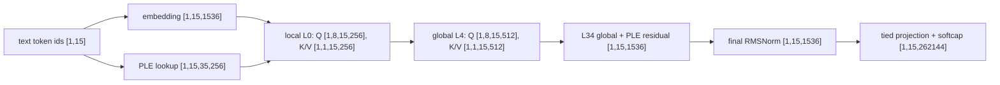
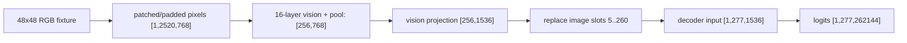

# PROMETHEUS G4-E2B-M0 — Gemma 4 E2B checkpoint authority and executable map

## Result

**SUCCESS.** The owner-provided original Hugging Face snapshot now validates
mechanically; pinned Transformers 5.6.2 executed deterministic CPU-BF16 text
and image cases against it. No Gemma Prometheus shader or reactor was added.

The audio reference path was not run because the local reference environment
lacks `librosa`/`soundfile`. This does not block M0: the required text and image
oracles ran, and audio is explicitly outside M1.

## Checkpoint authority

| item | authority |
| --- | --- |
| repository | `google/gemma-4-E2B-it` |
| revision | `3e22461f65e89153144f8adb70e3b8c2cc9845a7` |
| weights | one `model.safetensors`, 10,246,621,918 bytes, SHA-256 `2db5482b20d746879bb3ef79b5203e9075a2e2b98f54ec7c2f281c1477ddc550` |
| index | absent by design: this is an unsharded checkpoint, not an omitted index |
| tensors | 2,011 BF16 tensors; 10,246,357,958 logical payload bytes; 263,960 header/prefix bytes |
| header | 263,952 bytes; SHA-256 `12740d6fe7a66b316040fa4d77471a8e1809498a71992b3364a6d5417d10662e` |

The complete file and tensor authority (name, BF16 dtype, shape, byte extent,
and offset) is [checkpoint_authority.json](artifacts/G4E2BM0/checkpoint_authority.json).
The current local validation is [local_validation.json](artifacts/G4E2BM0/local_validation.json).
It rejects missing, renamed, extra, truncated, hash-mismatched, malformed,
overlapping, shape-incompatible, or duplicate safetensors objects.

The source root was repaired to the pinned snapshot. The replaced 203-byte
generation config and stray QAT card were preserved in the owner-local sibling
backup, not placed in the repository.

Relevant assets are `config.json` (4,954 bytes), `generation_config.json`
(208), `tokenizer.json` (32,169,626), `tokenizer_config.json` (3,082),
`processor_config.json` (1,689), and `chat_template.jinja` (18,569). The
generation defaults permit sampling, but the oracle explicitly disables it.

## Proven architecture

Facts in this section come from the pinned config, tensor authority, and
Transformers 5.6.2 `models/gemma4` source. Model-card statements were used only
as context.

- Text decoder: 35 layers, width 1,536, vocabulary 262,144, tied input/output
  embeddings, RMSNorm epsilon `1e-6`, no projection biases, final logit tanh
  softcap 30.
- PLE is real and dominant storage: main table `[262144,1536]` is 768 MiB;
  packed per-layer table `[262144,8960] = 35×256` is 4,480 MiB. The reference
  combines a token PLE lookup with a `[1536,8960]` context projection, scales,
  reshapes to `[B,S,35,256]`, RMS-normalizes, then applies a per-layer gated
  residual after FFN. PLE is not an optional side table.
- Layers 0–14 have FFN width 6,144; layers 15–34 use 12,288. Every fifth
  layer (`4,9,14,19,24,29,34`) is full attention; all others use causal
  sliding attention width 512. Local heads are 8×256 with one KV head; global
  heads are 8×512 with one KV head.
- Local RoPE is ordinary theta 10,000. Global p-RoPE is theta 1,000,000 with
  partial rotary factor .25. Q and K are RMS-normalized before RoPE; V is
  RMS-normalized without scale. Attention scale is 1.0 in the reference.
- Decoder order is RMSNorm → attention → RMSNorm → residual, then RMSNorm →
  gated `gelu_pytorch_tanh(gate) * up` FFN → RMSNorm → residual, then PLE
  gated residual. The checkpoint has K/V objects for all layers; the pinned
  implementation uses the configured 20-layer shared-KV scheme from layer 15
  onward and retains full-length source KV by attention type. Those later K/V
  checkpoint objects are consequently unexpected/ignored by that loader, an
  important implementation/checkpoint relation to preserve.
- Vision: 16 layers, width 768, 12×64 heads, patch 16, RMS epsilon `1e-6`,
  gated tanh-GELU FFN width 3,072, learned 2-axis position table
  `[2,10240,768]`, then 3×3 spatial pooling and RMSNorm-without-scale plus a
  `[1536,768]` projection. Pixels are RGB, bicubic aspect-preserving resized,
  scaled by 1/255, and are not normalized by the processor; the model applies
  `2*(x-.5)` at patch embedding.
- Audio: 16 kHz, 128 mel bins, frame/hop 320/160, two 3×3 stride-2 Conv2d
  subsamplers (1→128→32), 12 width-1,024 layers, 8×128 chunked attention
  (chunk 12, left context 12, right 0), output `[1536,1024]` projection, then
  RMSNorm-without-scale and `[1536,1536]` multimodal projection.
- The processor replaces each image placeholder with the encoder's valid soft
  tokens, and wraps audio with BOA/EOA while using dynamic token count capped
  at 750. Text PLE is computed before placeholders are replaced, using PAD for
  multimodal slots. Thinking mode is controlled by the chat template's
  `enable_thinking`; response parsing is specified in `tokenizer_config.json`.
  MTP assistants exist separately and are intentionally excluded.

The audio flow is proven but not executed: waveform → `[T,128]` mel → two
stride-2 convs → `[T/4,1024]` audio encoder → `[T/4,1536]` audio projection →
dynamic audio placeholder replacement → decoder. Its local Python dependency
is missing, so no numerical audio authority is claimed.

## Pinned reference oracle

`tools/gemma4e2b_reference_oracle.py` pins Transformers 5.6.2, PyTorch
2.9.1+cu130, CPU BF16 weights, eager attention, inference mode, fixed prompt,
chat template, and forward argmax. It commits no weights or full activations.
The compact results are [reference_oracle.json](artifacts/G4E2BM0/reference_oracle.json).
An immediate second full run was byte-identical (`0ddb75a4…` SHA-256).

Text prompt: `Name the first prime number.` with `enable_thinking=false`.
It is 15 tokens and greedily selects token 818 (`The`). Representative compact
boundaries are: embedding SHA `40910ad9…`, L0 RMSNorm `969264b7…`, Q
`3999e585…`, K `abd74262…`, V `4116fcda…`, post-softmax attention
`961c9992…`, attention output `a3a2af11…`, FFN `3d11b3f8…`, L0 output
`86020e3d…`, L17 output `5e74f3eb…`, final norm `744bc7f9…`, and logits
`507d3b45…`. Every boundary records dtype, FP32 summary-reduction precision,
shape, absolute maximum, L2 norm, and a stable F32-LE SHA-256.

The deterministic image fixture hashes to `524fdcdb…`; it yields 256 projected
soft tokens, positions 5–260, decoder boundary `[1,277,1536]` hash
`ec63db4b…`, final logits hash `d9c910f5…`, and token 818 (`The`). The
eager reference exposes post-softmax probabilities; this M0 deliberately does
not claim a pre-softmax capture.

## Prometheus reuse audit

| operation | classification | M1 consequence |
| --- | --- | --- |
| BF16 weight streaming | missing | Z-Image converts BF16 to FP16; Gemma must preserve BF16 and stream exact slices |
| FP32 activation ownership | directly reusable | retain existing resident/lifetime discipline |
| SGEMM and residual add | reusable with parameterization | dimensions/layout differ but existing device paths apply |
| row softmax | directly reusable only through 1,056 | local 512 fits; global prefill must be streamed/blocked |
| RMSNorm | model-private implementation exists; extraction needed | M46's fixed epsilon contract is not Gemma's `1e-6` contract |
| RoPE/p-RoPE | missing | Z-Image's 3-axis RoPE is not this 1-D ordinary/p-RoPE behavior |
| gated activation | reusable with parameterization | Gemma requires tanh-GELU, not accepted SiLU-only assumptions |
| local/global attention and causal masks | reusable with parameterization / missing mask-cache | M43 topology is not sufficient as-is |
| KV cache updates | missing | needs Gemma's local window, global lifetime, and shared-KV rule |
| embedding lookup/logits projection | missing / reusable with parameterization | PLE lookup is a first-class new loader operation; tied logits is GEMM |
| vision, audio, multimodal assembly | missing | deferred beyond text M1 |

FR-M0 remains closed and unchanged: its width-1,056 admission is used only as
evidence that local attention rows fit a production softmax boundary.

## Checked RTX 3070 plan

The physical checkpoint is 9.542910306 GiB, so it cannot be resident on the
8 GiB RTX 3070. Exact BF16 groups are PLE table 4.375 GiB, main embedding
0.750 GiB, text decoder 3.505912 GiB, audio 0.567781 GiB, vision 0.311742
GiB, and other projections/norms 0.032230 GiB.

The smallest useful text M1 resident package is L0 (69.015627 MiB), the global
PLE projection/norm (26.250488 MiB), and only the selected text/PLE rows
(20,992 bytes per token). For the 15-token oracle this is about 95.27 MiB of
immutable BF16 weights before FP32 work buffers; all large tables and later
layers remain host-resident and are streamed.

For a local layer, the explicit FP32 live-work formula is
`S × (1536 + 8×256 + 2×256 + 6144) × 4 = S × 40,960` bytes, before score
rows. At S=512 this is 20 MiB plus an 8 MiB 8-head local score tensor. At
S=2,048 it is 80 MiB plus 32 MiB local or 128 MiB global scores; at S=4,096
it is 160 MiB plus 64 MiB local or 512 MiB global scores. Late 12,288-wide
FFNs double the FFN component. Streaming global attention is therefore
required for practical long prefill.

Reference KV BF16 growth is 6,144 bytes/token for the three full global
sources; the twelve local layers cap at 6 MiB total for their 512-token
windows. Thus 128K global KV is 768 MiB plus 6 MiB local. The 48×48 image
case's FP32 patch input is 7.38 MiB; a naive 12-head 2,520² score tensor is
about 291 MiB, so the vision frontend also needs bounded attention working
sets. Audio's capped 750×1024 FP32 hidden state is 2.93 MiB; its chunk-12,
context-25 score workspace is bounded rather than quadratic.

Z-Image's dual-window policy cannot be reused unchanged: its fixed 0.36 GiB
blocks have no PLE table, causal KV lifetime, or alternating local/global
attention. Reuse its explicit staging/validation pattern, not its window size.

## Exact G4-E2B-M1 slice

Implement **text-only decoder layer 0 for the frozen 15-token oracle**:
stream exact BF16 L0 weights plus selected embedding/PLE rows; keep FP32
activations; execute main embedding, PLE token/context preparation, L0 local
Q/K/V RMSNorm/RoPE, causal 8-query/1-KV-head attention, tanh-GELU FFN, the
post-FFN PLE residual, and compare every captured L0 boundary above. Do not
start vision/audio, cache growth, p-RoPE/global attention, or a generic graph
framework in M1. This is the smallest end-to-end slice that exercises the
checkpoint's distinctive PLE and validates the reusable Prometheus core.
