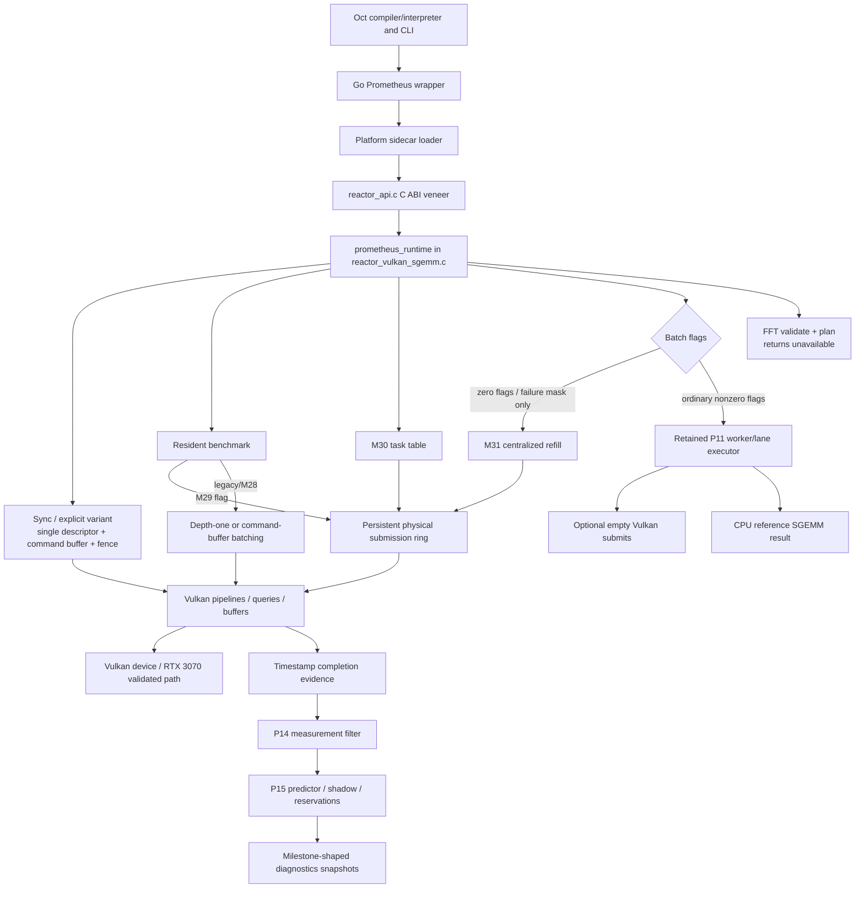

# Prometheus R0 forensic architecture audit

Status: report-only architecture inventory  
Snapshot date: 2026-07-10  
Scope: current repository state; no production behavior, tests, files, or names changed

## Executive summary

Prometheus has a real Vulkan SGEMM implementation, but it does not yet have one execution engine. It has four materially different execution authorities:

1. synchronous and explicit-variant SGEMM use a singleton descriptor set, command buffer, fence, and timestamp query pair;
2. resident M29, public M30 async, and zero-flag M31 batch use the persistent physical submission ring, with caller-specific command recording;
3. retained P11 batch modes use a separate worker/lane model that may submit empty Vulkan command buffers and then calculate results with the CPU reference SGEMM;
4. FFT validates and plans requests but truthfully returns unavailable; it does not dispatch hardware work.

The most important authority defect is the batch flag split. The default zero-flag batch route is real M31 Vulkan SGEMM. Ordinary nonzero topology/worker flags divert into the retained P11 executor. Its "physical" mode proves queue/fence plumbing with empty command buffers and produces matrix results on the CPU. This is useful historical contract scaffolding, but it is not production SGEMM authority and must not be presented as such.

`reactor_vulkan_sgemm.c` is 11,076 lines and owns device creation, pipelines, buffers, transfers, arenas, two different slot concepts, the physical ring, synchronous execution, resident execution, async task records, batch refill, retained P11 simulation, P14/P15 feedback, diagnostics, and test injection. Renaming it to a generic `core` file would preserve the problem. The correct next step is an R1 mechanical extraction into narrow Vulkan, scheduler, control, and operation modules, followed by a separate R2 authority consolidation.

Kernel addition is hand-wired through generated headers, runtime fields, initialization and destruction blocks, several variant/path/lifecycle switches, selector candidates, benchmark lists, diagnostics, tests, and documentation. A descriptor registry plus a separate runtime instance array can remove this switch cascade while preserving judgment as the deterministic selection authority.

Diagnostics are generally derived from real state, but their namespace and lifetime obscure that state. `PrometheusSgemmPolicyDiagnostics` is primarily the last synchronous SGEMM policy snapshot, not a uniform view of sync, async, and batch. Batch diagnostics combine mutually exclusive P11 and M31 schemas. Several transfer and P15 fields describe eligibility, mirrored state, or would-act behavior rather than an observed physical action. These distinctions need explicit source and authority labels in a sized diagnostics v2.

The recommended outcome is:

- R1: move and rename mechanically, introduce internal interfaces, quarantine retained paths, preserve the v1 ABI, and make Windows/Linux source lists equivalent;
- R2: make the shared job/ring route authoritative, remove decorative duplicates, add the kernel registry, migrate authority tests, introduce truthful diagnostics v2, and write current public documentation while retaining every milestone report as history;
- R3 only if real FFT execution needs a multi-dispatch job representation that should not be guessed during SGEMM cleanup.

This audit reaches **success for R0**: current authority is traced, the scar tissue is bounded, and a move-first/delete-later reorganization can be reviewed without starting implementation.

## Method and evidence boundary

The audit used source and reference searches, direct call-path inspection, build manifest comparison, test registration inspection, and the M29/M30/M30a/M31, P11, P14/P15, FFT, and SDSL-V reports. Historical reports were treated as evidence of intent, never as stronger authority than current code.

The complete per-file inventory is in `out/test-artifacts/prometheus_r0_file_inventory.json`. It contains 699 scoped files and records responsibility, genericity, role, visibility, likely destination, filename accuracy, and size/mixed-responsibility status. The machine-readable authority and deletion maps are:

- `out/test-artifacts/prometheus_r0_authority_map.json`
- `out/test-artifacts/prometheus_r0_deletion_candidates.json`

The JSON inventory covers all of `internal/prometheus/**`, the six Prometheus experiment labs, relevant public/internal/historical documentation, CI, and direct CLI/compiler/interpreter integration points. Classification is mechanical for low-risk bulk experiment artifacts and manually checked for production, generated, build, test, and current-documentation files.

"Production-authoritative" in this report means the path actually reached by an ordinary supported public call and responsible for the returned result. A real Vulkan submit that contains no SGEMM dispatch is not hardware SGEMM authority. A diagnostic field is not proof of an action unless its source is the completed physical operation.

## Current architecture and authority



The Go wrapper is narrower than the native ABI. It binds synchronous SGEMM and optional public async symbols. It does not expose batch, explicit benchmark, resident benchmark, full diagnostics, or FFT. Its explicit software fallback is authoritative when sidecar loading or probe is unavailable. Once a native call has begun, a native error is returned rather than hidden by fallback.

One bridge defect should be fixed during R2 ABI work: the Go loader passes an eight-byte configuration containing `struct_size` and `test_flags`, while the native create path reads `test_flags` only when `struct_size >= sizeof(PrometheusReactorConfig)` (currently larger). The Go test flags are therefore silently ignored. Normal production configuration is unaffected, but per-field size checks or generated ABI bindings are required.

## Part A — Repository inventory

### Native source families

| Files | Current responsibility | Classification | Future destination | Accuracy / size finding |
|---|---|---|---|---|
| `reactor_api.c`, `reactor_api.h` | C ABI forwarding, public enums/structs, compatibility aliases, test flags | public production API; mixed generic and operation-specific | stable root API plus versioned diagnostics/testing headers | API filename is accurate; the 1,364-line header is oversized and mixes ABI eras |
| `reactor_vulkan_sgemm.c`, `reactor_vulkan.h` | almost all Vulkan runtime and SGEMM execution | production authority plus retained test/legacy paths | split across `vulkan/`, `scheduler/`, `control/`, `operations/sgemm/` | SGEMM name is false for generic subsystems; source is a severe monolith |
| `reactor_vulkan_common.c` | runtime-service and shared Vulkan support | generic production support | `vulkan/runtime_services.*` or narrow service interfaces | broadly accurate, but "common" should not become a dumping ground |
| `reactor_vulkan_fft.c` | FFT validation, planning diagnostics, unavailable result | public truthful deferred operation | `operations/fft/fft.*`, `plan.*` | name is accurate; comments/tests must say no execution |
| `reactor_vulkan_fused_reduction.c` | inert placeholder | non-authoritative placeholder | archive/remove after roadmap decision | filename promises an implementation that does not exist |
| `reactor_dominatus_blackboard.*` | shared control observations/state | generic control | `control/blackboard.*` | product codename obscures responsibility |
| `reactor_dominatus_filter.*`, `reactor_dominatus_filter_policy.*`, `reactor_dominatus_measurement_filter.*` | filtering primitives and measurement admission | generic control | `control/filter.*`, `measurement_filter.*` | overlapping "filter" names need ownership clarification |
| `reactor_dominatus_predictor.*`, `reactor_dominatus_prestage.*`, `reactor_policy_memory.*` | P15 prediction, hypothetical pre-stage, persistent policy facts | generic/adaptive control | `control/predictor.*`, `shadow.*`, `policy_memory.*` | "prestage" can imply physical transfer; current behavior is advisory |
| `reactor_dominatus_sgemm_adapter.*` | SGEMM-to-control translation | operation-specific adapter | `operations/sgemm/control_adapter.*` | accurate after removing codename |
| `reactor_dominatus_slot_adapter.*`, `reactor_slot_hfsm.*` | logical two-slot lifecycle and control adapter | SGEMM lifecycle/control, not physical ring | `operations/sgemm/logical_slots.*` | "slot" collides with physical ring and P11 worker slots |
| `reactor_judgment_engine.*` | bounded candidate scoring, including SGEMM variant IDs | generic mechanism with SGEMM policy embedded | `control/judgment.*` plus SGEMM candidate adapter | variant enum ownership is misplaced |
| `reactor_sgemm_dispatch_metadata.h` | SGEMM geometry metadata contract | operation-specific | `operations/sgemm/dispatch_metadata.h` | accurate |
| thirteen `reactor_vulkan_*spirv.h` / generated shader headers | embedded kernel words and, for SDSL-V, generation metadata | generated operation assets | `shaders/generated/sgemm/` | ownership/provenance is inconsistent; baseline is still embedded in the monolith |
| `reactor_cuda_tc_kernels.h`, two CUDA `.ptx` files | orphan tensor-core experiment | experimental/orphaned, not built | experiment archive or R2 removal after provenance review | header references missing generated includes/source |
| `bridge.h` | include shim over `reactor_api.h` | compatibility support | remove or retain wrapper after include migration | name suggests a layer that is not present |
| `Marionette/test_harness.h`, `test_doom.h`, 43 test/benchmark `.cpp` files | native contracts, integration, hardware validation, benchmarks | tests | descriptive subsystem directories/names | many permanent names encode P/M/PX/stub milestones |

All individual `.c`, `.h`, `.cpp`, generated header, Go, script, report, and experiment records are enumerated in the JSON artifact. In particular, no generated SPIR-V header or Marionette source is represented only by a wildcard in that artifact.

### Go, scripts, shaders, reports, and experiments

| Area | Current truth | Classification | Future treatment |
|---|---|---|---|
| `internal/prometheus/runtime.go` | wrapper validation, CPU reference/fallback, sync execution, async hardware validation | production Go API | keep SGEMM API separate from loader details; use named/generated ABI constants |
| `bridge.go`, platform `reactor_loader*` files | sidecar discovery, dynamic load, symbol binding | production bridge | loader module with explicit required/optional symbol manifest |
| Go tests | fake loader, fallback, boundary validation; one Windows/native tagged sync integration | contract tests, not broad hardware authority | add cross-platform sidecar build/load and production-path tests |
| `internal/prometheus/shaders/sdslv/*.comp` | six SDSL-V SGEMM sources | operation source | `shaders/sources/sgemm/` or retain with manifest |
| `generate_sdslv_shaders.ps1` | six repeated generation jobs | generated-asset owner | drive from a single manifest and validate drift in CI |
| `build_stub.sh`, `build_windows.cmd` | full Linux/Windows native builds and Marionette binaries | authoritative developer builds, duplicated | common source manifest plus platform drivers; compatibility wrapper for old Linux name |
| profiling scripts | Nsight/feed-path workflows with M28/PX16 and local RTX assumptions | internal diagnostic tooling | descriptive profiling names with configurable tools/output |
| `Make.oct` | prototype/dogfood flow metadata; invokes Linux stub-named script | internal experiment, not authoritative cross-platform build | either make real or label explicitly as prototype |
| `internal/prometheus/DevelopmentReport/**`, `ValidationReport/**` | milestone evidence | historical | preserve verbatim; index, do not rewrite |
| `Experiments/PrometheusSgemmAlgorithmLab/**` | 312 source/report/generated experiment files | experiment history | add topic/status index; never use as runtime authority |
| five other Prometheus labs | filtering, prediction, shadow, FFT, and benchmark experiments | experiment history | preserve with indexes and links from relevant current docs |
| direct CLI/compiler/interpreter files | connect Oct-facing calls to Go wrapper | production integration | retain in owner modules; include in API authority tests |
| `.github/workflows/ci.yml` | Go-oriented CI | CI | add native source parity, generated drift, compile, and non-hardware contract lanes |

## Part B — Production authority map

| Capability | Public entry | Production path | Test / benchmark path | Legacy duplicate | Diagnostics source | Recommendation |
|---|---|---|---|---|---|---|
| Synchronous SGEMM | `prometheus_reactor_runtime_sgemm` | API veneer → shared sync implementation → singleton descriptor/command buffer/fence/query → Vulkan submit | stub/P13/P14/P15/PX16 tests; explicit benchmark shares implementation | old singleton async injection branch | policy blackboard and last-dispatch fields | migrate to job/ring only after parity tests |
| Explicit benchmark SGEMM | `...sgemm_benchmark_variant` | sync implementation with selector disabled | P13/PX16 explicit variant suites | repeated variant maps | P13/PX16 policy fields | registry-driven lookup, stable IDs |
| Resident SGEMM | `...sgemm_resident_benchmark` | sync setup then M29 ring when flagged; otherwise depth-one/M28 loop | M28/M29 tests and profiling | depth-one and M28 command-buffer batching | resident result + policy | retain as diagnostic modes through R1, consolidate later |
| Public async SGEMM | async submit/query/consume/abandon | four task records → task-owned host-visible buffers → shared ring → baseline direct pipeline → ordered harvest | M30/M30a hardware tests; Go async validator | singleton state/update function | async status and diagnostics | extract task lifecycle/job recording; then delete singleton path |
| Batch SGEMM | `...sgemm_batch` | zero flags/fail mask → M31 centralized refill/ring/atomic commit | one focused M31 hardware suite | nonzero flags → P11 CPU/empty-submit executor | combined P11/M31 batch struct | keep all production flags on M31 in R2 |
| Upload/readback | implicit | sync direct or staged buffers; eligible upload can use transfer queue; final readback | transfer diagnostics tests; resident setup | async/batch bypass with host memcpy | transfer blackboard/mirrors | test observed submissions, not eligibility mirrors |
| Physical ring | indirect | persistent buffers/fences/queries/sequence numbers used by resident/async/M31 | M29/M30/M30a/M31 | sync command buffer, M28 batch, P11 slots | per-caller counters/results | one physical ownership subsystem |
| Quarantine/reap | async API lifecycle | task resources retained until fence/device evidence permits reap | M30a failure injection | singleton reset model | async counters/lifecycle | generic scheduler retirement module |
| Ordered feedback | implicit completion | sequence-ordered evidence drain → P14 → P15 | M30 integration + primitive contracts | sync commits directly | task sequence and control counters | extract Vulkan-independent completion feedback |
| P14 filter | implicit | real query observation → measurement filter → blackboard | focused synthetic contracts + production sync/async tests | old raw timing mirrors | P14 and P13 timing fields | compact observed-evidence diagnostics |
| P15 predictor/shadow/reservations | implicit; exported test seed | filtered evidence → predictor/policy memory → advisory shadow state | primitive tests + sync/ordered async integration | public test injection, milestone mirrors | P15 policy fields | label advisory state; move test seed out of production API |
| Slot HFSM | implicit sync path | two logical SGEMM buffer/transfer slots | HFSM and sync tests | physical ring slots and P11 worker slots are distinct | `m29_*` policy fields | rename logical lifecycle; never conflate with ring slots |
| Memory/arenas | implicit | typed arenas/budget/artifact invalidation in sync planning | M1/SGEMM tests | task-owned async/M31 buffers | arena/cache policy fields | split Vulkan allocation from operation artifact policy |
| Kernel selection | implicit sync; explicit bypass | judgment candidates 1–5 → pipeline switch | judgment/P13/PX16 | repeated eligibility/name switches; async fixed baseline | requested/selected/executed trace | registry provides facts; judgment remains selector authority |
| Dispatch metadata | implicit | generated or handwritten metadata → group counts and record | generated checks/benchmarks | switches for metadata/path/pipeline/lifecycle | dispatch and variant fields | generated descriptor fragments + validation |
| FFT | FFT and FFT benchmark APIs | validate/plan, then return unavailable | truthfulness/planning; benchmark measures unavailable calls | none | FFT diagnostic table | keep truthful; do not invent execution abstraction yet |
| Software fallback | Go `RunSGEMM` | explicit CPU fallback on load/probe unavailable | fake loader/fallback tests | native P11 CPU batch masquerades as successful native result | Go backend/stage/reason | keep explicit Go fallback; remove unlabelled native production fallback |
| Native loading | Go execution APIs | candidate discovery → load sidecar → bind sync/optional async symbols | fake loaders; Windows tagged native sync test | source-tree and `out/` copies | Go loader errors/result | generated symbol manifest and Windows/Linux CI parity |
| Go wrapper | `RunSGEMM`, compiled matmul helper, async validator | validation/reference → loader → C ABI | Go unit/integration and CLI | magic numeric ABI assumptions | Go result plus selected native fields | generated constants/types; add missing authoritative integrations |

The complete expanded rows, including whether tests share the same physical engine, simulated/deferred state, benchmark routes, and old-test dependencies, are in the authority JSON.

## Part C — Legacy and scar-tissue audit

| Item | Evidence / present reachability | Classification | Later action |
|---|---|---|---|
| `update_async_progress` | static definition; no lexical call site; reports describe superseded query/consume behavior | safe to remove after proof | R2 delete after M30 diagnostics parity |
| `prom_fp16_bits_to_float32` | static definition; no lexical call site | safe to remove later | linker/dead-code confirmation, R2 |
| singleton async dimensions/copy size/state | assignments/test branch remain; public async uses task records | migrate before removal | replace old injection tests with public async authority tests |
| skip-submit/wait old async branch | reached only through test configuration and null output contract | test-only legacy | move to test seam in R1, delete in R2 |
| P11 lane simulation | CPU reference is the result authority | historical contract simulator | isolate, migrate tests, remove from public route |
| P11 "physical" workers | worker-local pools/buffers/fences submit empty command buffers before CPU calculation | simulated physical resources | replace with real ring ownership/topology tests |
| old depth-one resident path | real Vulkan but superseded by persistent ring | diagnostic/benchmark compatibility | keep until ring parity proves replacement |
| M28 diagnostic batch depth | batches command buffers; not resident in-flight depth | historical diagnostic | retain only if it still provides profiling value |
| `compute_queues[8]` / separate queue topology | production initializes one queue; multiplicity belongs to P11 scaffolding/tests | uncertain compatibility | investigate public flag promises before removal |
| logical HFSM, physical ring, P11 worker slots | three ownership models share the word "slot" | duplicate conceptual models | preserve names in R1 wrappers, consolidate in R2 |
| arena-managed sync buffers vs task-owned buffers | two allocation/retirement models | duplicate ownership model | separate generic allocation first; unify deliberately |
| variant/path/lifecycle switches | repeated across init, cleanup, dispatch, diagnostics, tests | active scar tissue | replace with registry in R2 |
| `PROM_BACKEND_STUB`, stub reason | no current return path found | ABI/history | deprecate/tombstone; do not renumber |
| separate-family topology enum | declaration without implementation reference | uncertain public compatibility | investigate external consumers |
| alias/not-wired path state | not produced by current runtime mapping | stale compatibility value | diagnostics v2 deprecation |
| runtime create/destroy/probe old aliases | forwarding symbols only | must remain until ABI policy exists | compatibility wrappers |
| public P15 test seed | test-only control injection in public ABI | migrate before removal | testing-only export/header |
| fused reduction file | inert placeholder | uncertain roadmap | archive or delete after owner decision |
| CUDA PTX/header | not in Vulkan build; references missing includes/source | high-confidence orphan | preserve provenance, then R2 delete/archive |
| FFT future fields | permanently zero because execution unavailable | deferred scaffolding | keep v1 compatibility; internalize in v2 |

No item is deleted in R0. The conservative machine list records references, test dependencies, migration, confidence, and phase.

## Part D — `reactor_vulkan_sgemm.c` decomposition

Line ranges are approximate and intentionally describe ownership clusters rather than promising stable source coordinates.

| Lines / representative symbols | Responsibility and owned state | Dependencies / coupling | Genericity | Proposed destination | Difficulty / risk |
|---|---|---|---|---|---|
| 1–139: ring/task types | physical slots, task identities, completion records | Vulkan handles, SGEMM metadata, runtime struct | mixed scheduler/Vulkan | `vulkan/submission_ring.*`, `scheduler/compute_job.*` | high: types are embedded throughout runtime |
| 140–266: generated metadata and geometry | variant → dispatch metadata and group counts | generated headers, variant enum | SGEMM-specific | `operations/sgemm/dispatch.*` and registry descriptors | medium |
| 267–727: buffer, arena, controller, diagnostic internal types | ownership and policy snapshots | nearly every subsystem | mixed | subsystem-owned private headers | high: hidden static coupling |
| 728–898: `prometheus_runtime` | aggregate device, pipelines, ring, tasks, singleton resources, control, caches, arenas | everything | mixed/god state | opaque aggregate of subsystem states in `runtime/runtime.*` | high |
| 899–1154: platform glue and embedded baseline SPIR-V | locking/thread helpers, baseline kernel bytes/constants | OS/Vulkan/compiler | mixed | `platform/`, generated shader area | medium |
| 1155–1967: P11 helpers, workers, queues, CPU reference | legacy batch topology and result production | runtime queues, host memory, threads | legacy SGEMM/test | `testing/legacy_batch_contract.*` during R1 | high due test reliance, low production value |
| 1968–2001: selector cache | cached judgment inputs/results | control engine and variants | SGEMM policy | `operations/sgemm/selection.*` | low |
| 2002–2165: transfer telemetry | path/queue facts and mirrors | blackboard, runtime buffers | generic transfer with SGEMM projection | `vulkan/transfer.*`, diagnostics projection | medium |
| 2166–2310: singleton async mirror/update | old async state and progress | singleton fence/query/runtime fields | legacy | R1 legacy module; R2 removal | medium |
| 2311–2669: checked sizes and slot orchestration | dimensions, two logical HFSM slots | SGEMM buffers, transfer state, HFSM | SGEMM lifecycle | `operations/sgemm/logical_slots.*` | medium/high |
| 2670–2917: FP16/packed4 packing, tolerances, CPU oracle | operation layouts and debug reference | kernel contracts, host buffers | SGEMM-specific | `operations/sgemm/layouts.*`, test oracle | medium |
| 2918–3103: controller/policy helpers | measurements, selection/control snapshots | judgment, policy memory, blackboard | generic mechanism + SGEMM adapter | `control/*`, `operations/sgemm/control_adapter.*` | high: diagnostics are direct consumers |
| 3104–3174: runtime handle registry/services | handle lookup and Vulkan services seam | runtime lifetime, FFT | generic | `runtime/registry.*`, `vulkan/runtime_services.*` | medium; concurrency contract unclear |
| 3175–4160: typed arenas/buffers/artifacts | allocation, budgets, invalidation, resource ownership | Vulkan memory, SGEMM layouts, diagnostics | mixed | `vulkan/buffers.*`, `operations/sgemm/artifacts.*` | high: destruction and aliasing risk |
| 4160–4386: timing reset and cleanup | reset metrics; destroy pipelines, buffers, queries, pools, device | all resource states | generic lifecycle plus SGEMM assets | subsystem destructors called by runtime | very high ordering risk |
| 4387–4641: instance/device/family/capability setup | Vulkan instance, device, queues, query pool | platform/Vulkan | generic | `vulkan/device.*`, `timestamps.*` | medium/high |
| 4642–4737: pools/descriptors/ring set setup | command pools, descriptor layout/pool/sets, ring resources | device and SGEMM bindings | mixed | generic pools/ring plus SGEMM descriptor schema | high |
| 4742–5086: shader modules and pipeline cascade | create every SGEMM module/pipeline individually | generated headers, runtime fields | SGEMM asset lifecycle | `shaders/registry.*`, `vulkan/pipelines.*` | high now; low after descriptor validation |
| 5088–5147: command buffers/fences/semaphore | singleton and ring physical resources | device/pools/queries | generic execution | `vulkan/submission_ring.*`, sync adapter | high |
| 5153–5350: create/destroy/probe | runtime coordinator and public implementation | all subsystems | generic coordinator | `runtime/runtime.*` | high; keep coordinator small |
| 5355–5591: lifecycle/path/name/fallback/P15 mapping | kernel identity and diagnostics translations | variants, selector, public enums | SGEMM-specific | registry facts + diagnostics projection | medium |
| 5604–7320: sync/explicit implementation | validation, selection, layout, allocation, descriptor writes, submit, readback, policy feedback | every subsystem | SGEMM coordinator | `operations/sgemm/sgemm.*`, `planning.*`, generic executor | very high; extract last |
| 7322–7389: percentiles and pipeline lookup | resident statistics and variant switch | variants/pipelines | mixed | `diagnostics/statistics.*`, registry instance lookup | low/medium |
| 7391–7550: ring init/submit/poll/harvest | physical slot reuse and completion evidence | Vulkan fences/queries/command buffers | generic | `vulkan/submission_ring.*` | high but bounded and valuable |
| 7566–8174: resident record/dispatch/benchmark | resident buffer binding, variant dispatch, loop/readback | ring, sync setup, SGEMM layout | SGEMM-specific | `operations/sgemm/resident.*` | high |
| 8188–9686: public batch and retained P11 executor | routing, topology simulation, worker resources, CPU result, diagnostics | P11 helpers, runtime queues | mixed production entry + legacy | thin batch API + isolated legacy module | high due semantic split |
| 9688–9794: task lookup/state/id | public async record management | runtime task table | generic scheduler with SGEMM payload | `scheduler/async_tasks.*` | medium |
| 9795–9840: reap/quarantine | safe resource retirement | fences/device state/task ownership | generic scheduler | `scheduler/retirement.*` | medium/high |
| 9841–9922: async record/poll | descriptor writes, baseline dispatch, fence/query harvest | SGEMM pipeline, ring, task buffers | mixed | SGEMM record callback + generic ring poll | high |
| 9923–9972: ordered feedback | sequence-ordered P14/P15 commits | completion evidence/control | generic completion/control | `scheduler/completion_feedback.*` | medium |
| 9973–10179: public async functions | submit/query/diagnose/consume/abandon | task table, ring, buffers | SGEMM API + scheduler | `operations/sgemm/async.*` over scheduler | high |
| 10181–10360: M31 refill | centralized admission, ring refill, atomic staging/commit | async record helpers, task buffers | scheduler pattern with SGEMM plan | `scheduler/batch_refill.*`, SGEMM batch adapter | medium/high |
| 10362–11076: diagnostics filling/export | flatten all runtime/control/legacy states into public structs | every subsystem | projection layer | `control/diagnostics.*` plus operation projections | high ABI risk |

Extraction order matters. The ring, evidence records, and immutable metadata are good early seams. The synchronous coordinator and flattened diagnostics are poor first seams because they currently know everything.

## Part E — Target module architecture

```text
internal/prometheus/native/
  reactor_api.c
  reactor_api.h
  runtime/
    runtime.c              runtime.h
    handle_registry.c      handle_registry.h
  vulkan/
    device.c               device.h
    buffers.c              buffers.h
    descriptors.c          descriptors.h
    pipelines.c            pipelines.h
    submission_ring.c      submission_ring.h
    timestamps.c           timestamps.h
    transfer.c             transfer.h
    runtime_services.c     runtime_services.h
  scheduler/
    compute_job.c          compute_job.h
    async_tasks.c          async_tasks.h
    batch_refill.c         batch_refill.h
    retirement.c           retirement.h
    completion_feedback.c  completion_feedback.h
  control/
    blackboard.c           blackboard.h
    measurement_filter.c   measurement_filter.h
    predictor.c            predictor.h
    shadow.c               shadow.h
    policy_memory.c        policy_memory.h
    judgment.c             judgment.h
    diagnostics.c          diagnostics.h
  operations/
    sgemm/
      sgemm.c              sgemm.h
      planning.c           planning.h
      layouts.c            layouts.h
      dispatch.c           dispatch.h
      selection.c          selection.h
      resident.c           resident.h
      async.c              async.h
      batch.c              batch.h
      logical_slots.c      logical_slots.h
      control_adapter.c    control_adapter.h
    fft/
      fft.c                fft.h
      plan.c               plan.h
  shaders/
    registry.c             registry.h
    manifest.json
    generated/sgemm/*.h
    sources/sgemm/*.comp
  testing/
    injection.h
    legacy_batch_contract.c
```

This is a responsibility layout, not a requirement to create every tiny file in one change. Files should exist only when the owned state and API are coherent.

| Module | Responsibility / owned state | Internal API | Allowed dependencies | Forbidden dependencies | Current material | Kind |
|---|---|---|---|---|---|---|
| `runtime/runtime` | aggregate subsystem lifetime and feature availability | create/destroy/probe; obtain narrow subsystem handles | device, scheduler, registered operations | kernel-specific switches, control algorithms, layout packing | create/destroy/probe and aggregate runtime | generic coordinator |
| `runtime/handle_registry` | public handle validation/lifetime lookup | register/get/unregister | runtime only | Vulkan commands, SGEMM | handle table | generic |
| `vulkan/device` | instance, physical/logical device, family/capability/queue facts | create/destroy device; immutable capabilities | Vulkan/platform | operations, control, diagnostics policy | init device/family/queue blocks | generic |
| `vulkan/buffers` | `VkBuffer`/memory allocation, map/unmap, ownership | allocate/free/map/copy facts | device | SGEMM dimensions, selector | low-level buffer helpers | generic |
| `vulkan/descriptors` | descriptor layouts/pools/sets from binding schemas | create/destroy/update | device, registry schemas | policy/control | descriptor init/writes | generic with operation schemas |
| `vulkan/pipelines` | create runtime instances from kernel descriptors | instantiate/destroy/get pipeline | device, shader registry | selector decisions | pipeline cascade and cleanup | generic |
| `vulkan/submission_ring` | physical slots, fences, query ranges, sequence and reuse rules | reserve/submit/poll/harvest/drain | device, timestamps, immutable recorded work | SGEMM planning, P14/P15 | M29/M30/M31 ring mechanics | generic |
| `vulkan/timestamps` | query pool ownership and evidence conversion | allocate/reset/read timestamps | device | filtering/prediction | query setup/readback | generic |
| `vulkan/transfer` | observed upload/readback submissions and queue ownership | plan/record/submit transfer; evidence | device, buffers, ring | SGEMM selector, hypothetical prestage | staged transfer code/telemetry | generic |
| `vulkan/runtime_services` | narrow service table for operations such as future FFT | capability and resource functions | Vulkan modules | operation planning | existing FFT seam | generic |
| `scheduler/compute_job` | immutable job identity, ownership, requirements, dispatch/binding description, completion evidence | construct/validate; attach physical sequence/evidence | registry IDs and opaque resource handles | SGEMM layout internals, Vulkan global state | common async/M31/resident facts | generic minimal model |
| `scheduler/async_tasks` | token generation, public/private task lifecycle | allocate/find/query/consume/abandon | compute job, retirement | Vulkan device setup, selector | M30 task table | generic lifecycle |
| `scheduler/batch_refill` | admission/refill/ordered entry scheduling and atomic result staging | run/refill/commit batch of jobs | compute job, ring | SGEMM math, P11 simulation | M31 loop | generic scheduling pattern |
| `scheduler/retirement` | quarantine and reap resource ownership | quarantine/poll/reap/drain | ring evidence, buffer owner callbacks | operations/control | M30a code | generic |
| `scheduler/completion_feedback` | sequence-ordered delivery of immutable observations | enqueue/drain evidence | control observation interface | Vulkan commands, operation layouts | M30/M31 feedback ordering | generic |
| `control/*` | measurement filtering, prediction, shadow/advisory state, policy memory, deterministic judgment | accept observation; produce traceable recommendation | immutable facts | Vulkan handles, command recording | Dominatus/P14/P15/judgment modules | generic mechanisms |
| `control/diagnostics` | project versioned snapshots; never drive execution | fill sized public/internal diagnostics | read-only subsystem snapshots | mutation/selection | diagnostics tail and adapters | generic projection |
| `operations/sgemm/planning` | validate dimensions/layout/precision; immutable SGEMM plan | build/destroy plan | registry facts, control recommendation | Vulkan global lifetime | sync planning/checks | operation-specific |
| `operations/sgemm/layouts` | pack/unpack, byte sizes, tolerances | layout transforms/requirements | plain host utilities | device/scheduler/control | FP16/packed4 helpers | operation-specific |
| `operations/sgemm/dispatch` | push constants, binding schema, geometry, record callback | describe/record a planned dispatch | pipeline instance, descriptor writer | selector policy | variant geometry and record code | operation-specific |
| `operations/sgemm/selection` | build bounded kernel candidates/considerations from plan/device/control facts | choose ID with trace | judgment, registry facts | pipeline creation | selector cache/mapping | operation-specific policy adapter |
| `operations/sgemm/sgemm` | small sync coordinator | execute planned SGEMM | planning, scheduler/executor, layouts | device initialization details | public sync implementation | operation-specific |
| SGEMM resident/async/batch | API adapters that construct jobs and define result semantics | operation entrypoints | SGEMM plan, generic scheduler | duplicated ring logic | existing caller-specific blocks | operation-specific adapters |
| `operations/sgemm/logical_slots` | two-slot buffer/transfer HFSM | transition/query logical readiness | HFSM/control adapter | physical ring ownership | slot HFSM/adapters | operation-specific lifecycle |
| `operations/fft` | current validation/plan/unavailable contract; later FFT execution | validate/build plan/execute when available | runtime services, future job API | SGEMM internals | FFT source | operation-specific |
| `shaders/registry` | stable descriptors and runtime-instance indexing | enumerate/lookup/validate descriptors | generated data, Vulkan pipeline API | selector heuristics | all variant switches/headers | generic registry with operation entries |
| `testing` | compile-time or separate-library fault injection and retained P11 contract simulator | explicit test-only interfaces | narrow subsystem hooks | public production ABI/routing | test flags, P15 seed, P11 | test only |

Dependency direction is API → runtime coordinator → operation adapters and scheduler → Vulkan primitives. Control consumes observations and returns decisions without Vulkan knowledge. Vulkan never includes SGEMM or control headers. Operations may use registry descriptors and job builders but not scheduler private state. Diagnostics read subsystem snapshots and never participate in decisions. These rules prevent a new `core` junk drawer and circular dependencies.

## Part F — Shared compute-job abstraction

A minimal shared job is justified because M30 async and M31 batch duplicate task buffers, recording, physical admission, and completion evidence, while resident execution already shares ring mechanics. It should not attempt to model every future FFT pass now.

```c
typedef struct prom_compute_job {
    prom_operation_kind operation;
    uint64_t job_id;
    prom_job_owner owner;
    const prom_operation_plan *plan;       /* immutable, operation-owned */
    prom_kernel_id kernel;
    prom_binding_set bindings;
    prom_dispatch_geometry dispatch;
    prom_resource_requirements resources;
    uint64_t submission_sequence;
    prom_physical_slot_identity physical_slot;
    prom_completion_evidence completion;
} prom_compute_job;
```

Generic facts are identity, owner, immutable-plan lifetime, resource requirements, kernel identity, opaque bindings, dispatch geometry, physical submission sequence/slot generation, and completed evidence. SGEMM keeps M/N/K, transpose/layout, precision, packing, tolerance, selector inputs, and output staging. FFT keeps transform shape/direction, radix/pass planning, ping-pong buffers, and twiddle ownership.

Adopt this in R2 first for SGEMM async and M31 batch. Add a resident adapter only after parity; move sync last. Do not place speculative FFT fields in a tagged union. A real FFT may require a bounded list of dispatch steps or an operation record callback; that evolution belongs in R3 when execution evidence exists. The abstraction is worthwhile if it eliminates duplicate admission/ownership/completion logic, not if it merely renames `prom_async_task_record`.

## Part G — Kernel registry audit

### Exact current add-a-kernel checklist

Adding a kernel today requires checking or changing all of the following:

1. add shader source, or add/obtain an embedded SPIR-V header;
2. for SDSL-V, add another repeated job block to `generate_sdslv_shaders.ps1` with source, native output, header output, symbol prefix, entry point, and include guard;
3. add the generated header include to the native compilation unit;
4. add a stable variant value to `PromSgemmVariant` in `reactor_judgment_engine.h`;
5. add or map a public executed-path ID in `reactor_api.h` if the path is externally distinguished;
6. add shader-module and pipeline fields to `prometheus_runtime`;
7. add shader-module creation in Vulkan initialization;
8. add compute-pipeline creation with the correct layout and entry point;
9. choose and consistently implement shader-module lifetime; current kernels differ between retained modules and temporary modules destroyed after pipeline creation;
10. add pipeline/module cleanup in reverse lifetime order;
11. add generated dispatch metadata, or extend `prom_sgemm_generated_dispatch_metadata_for_variant`;
12. add dispatch geometry and any push-constant/binding differences;
13. update registered-range and "wired" predicates;
14. update path-status mapping;
15. update executed-identity/path-ID mapping;
16. update fallback/lifecycle mapping and lifecycle diagnostics;
17. add the pipeline to the sync selected-pipeline switch;
18. add the pipeline to resident lookup;
19. decide whether async/M31 remain baseline-only or add the variant to their record path;
20. if production-selectable, add a bounded candidate and considerations to the judgment engine; variants 6–11 are currently explicit-only;
21. decide `benchmark_enabled`, `production/selectable`, DVT, PVT, and capability requirements; today these facts are scattered or inferred;
22. update name mappings and artifact keys;
23. update duplicated variant lists/name tables in P13/PX16 tests and benchmark writers;
24. add focused dispatch, lifecycle, correctness, fallback, and generated-metadata tests;
25. update Windows and Linux build/generated ownership if a new source/header/tool is involved;
26. update current kernel documentation and preserve any validation report as history.

This list explains why a compiled shader can be "built but not actually hooked up." No single structure proves that bytes, metadata, pipeline, selection eligibility, dispatch recording, diagnostics, and destruction all agree.

### Proposed declarative registry

Use two layers rather than storing mutable Vulkan handles in immutable descriptors:

```c
typedef struct prom_kernel_descriptor {
    uint32_t operation;
    uint32_t variant_id;
    const char *name;
    const uint32_t *spirv_words;
    size_t spirv_size;
    const char *entry_point;
    prom_binding_schema_id binding_schema;
    prom_dispatch_metadata dispatch;
    uint32_t benchmark_enabled;
    uint32_t production_enabled;
    uint32_t dvt_validated;
    uint32_t pvt_validated;
    uint32_t capability_mask;
} prom_kernel_descriptor;

typedef struct prom_kernel_instance {
    const prom_kernel_descriptor *descriptor;
    VkPipeline pipeline;
    prom_kernel_init_status status;
} prom_kernel_instance;
```

Use a generated/static hybrid. A single manifest owns source, symbol, entry point, operation, binding schema, dispatch metadata, and stable variant ID. SDSL-V generation emits the SPIR-V header and a descriptor fragment. A small reviewed static table owns release-policy facts such as benchmark, production selection, DVT/PVT, and capability eligibility if those must not be silently changed by a generator. The build validates that every manifest record has exactly one descriptor and generated asset.

Runtime initialization iterates descriptors, validates unique nonzero IDs, word alignment/size, entry point, known operation/binding schema, dispatch constraints, capability compatibility, and non-contradictory lifecycle flags, then creates a same-index instance. Shader modules can be destroyed uniformly after pipeline creation. Destruction iterates instances in reverse. Lookup is ID → immutable descriptor and runtime instance; IDs are never renumbered and removed IDs remain tombstones.

The registry supplies facts. It does not select kernels. The judgment engine receives only registry entries that are both runtime-capable and policy-eligible, builds named considerations, scores deterministically, and retains the trace. Explicit benchmark lookup may use `benchmark_enabled` entries that are not production-selectable. Diagnostics report requested, selected, executed, fallback, and descriptor lifecycle as separate facts.

Target kernel workflow: add source and one manifest/registry record, regenerate, add focused tests. CI must fail on missing bytes, metadata, pipeline creation coverage, duplicate IDs, stale generated output, or a production-enabled descriptor that cannot be selected/recorded.

## Part H — Diagnostics truth audit

| Diagnostics | Real source and authority | Truth problem | Recommendation |
|---|---|---|---|
| `PrometheusSgemmPolicyDiagnostics` | mostly runtime blackboard, last sync dispatch, arenas, transfer, P14/P15; real for the last path that updates those fields | not a uniform sync/async/batch snapshot; P13/P14 timing and P13/PX16 kernel mirrors overlap; `m29_*` slots are logical HFSM, not ring; `m31_transfer_*` predates M31 batch; no struct member version despite sized getter | retain v1; add sized v2 sections for execution, observed transfer, control, and compatibility; deprecate mirrors |
| `PrometheusSgemmBatchDiagnostics` | either retained P11 worker state or M31 ring/refill state | mutually exclusive schemas share one unsized struct; default zeros can be misread as observations; no explicit engine/schema discriminator | add `struct_size`, version, `engine_kind`, common outcome, and tagged engine-specific detail; split simulator diagnostics internal |
| `PrometheusSgemmAsyncDiagnostics` | real task-table/ring/quarantine counters | `max_in_flight` is runtime ring high-water and can reflect other ring clients; no sized API; consumed records disappear on reuse | add scope/owner qualifiers, sized version, and cumulative vs current labels |
| `PrometheusAsyncStatus` | task-record lifecycle and completion evidence | authoritative for a live token; compatibility lifecycle names duplicate physical/public concepts | keep, size/version future extension, document token-generation/reuse semantics |
| slot diagnostics | logical HFSM fields in policy; physical ring counters in async/batch/resident; P11 worker slots in batch | three unrelated concepts named slot; milestone prefixes imply false ownership | separate `logical_buffer_slot`, `physical_submission_slot`, and internal legacy worker-slot views |
| transfer diagnostics | sync transfer policy/blackboard and observed state; async/batch mostly host memcpy | queue availability/eligibility or seeded mirrors can look like actual use; current async transfer test does not prove an async transfer submission | expose `eligible`, `planned`, `submitted`, `completed`, queue family, sequence, and bytes as distinct evidence; move hypothetical fields internal |
| P14 diagnostics | raw Vulkan timestamp evidence and filter outcome in production integration | old raw timing mirrors overlap; primitive tests use synthetic evidence appropriately | keep compact raw/accepted/rejected/filter-reason view; preserve full trace internally |
| P15 diagnostics | predictor/policy/shadow facts derived from filtered evidence | names such as pre-stage/reservation can imply physical action; current agree-and-confirm path does not override execution | prefix advisory fields with `would_`/`shadow_`; distinguish recommendation, confirmation, and applied action; move test seed internal |
| kernel/variant diagnostics | requested/selected/executed/fallback maps and pipeline status | `production_eligible` can mean wired/dispatchable even for explicit-only variants; DVT/PVT facts are incomplete/stale; duplicated P13/PX16 fields | source from registry + selector trace; define `dispatchable`, `benchmark_enabled`, `selector_eligible`, `validated`, and `executed` separately |
| FFT diagnostics | request validation and plan facts from FFT module/global handle table | truthful unavailable, but arena/cache/executed fields are future zeros; global 32-entry table has no evident concurrency protection | public v2 should expose request/plan/unavailable reason; keep future execution fields internal until real; move state into runtime-owned FFT object |
| device diagnostics | actual Vulkan device/queue/capability discovery | broadly authoritative | keep, size/version, and make immutable per-runtime facts |

Diagnostics must obey a simple rule: an observed physical action requires a sequence/fence/query-derived source. Eligibility, policy intent, simulator state, and would-act control output are useful, but must have different names and sections.

## Part I — Test authority audit

| Subsystem / tests | What is actually proved | Classification and action |
|---|---|---|
| sync SGEMM suites in `reactor_stub_tests.cpp`, P13/P14/P15, PX16 | real sync engine when hardware is present; many names/messages remain milestone/stub shaped | preserve behavior; rename descriptively in R1 |
| explicit kernels in P13/PX16 files | real explicit pipeline dispatch/correctness for enumerated variants | production benchmark authority; replace local lists with registry enumeration in R2 |
| M29/M30/M30a/M31 cases in `reactor_m29_fixed_double_tests.cpp` | ring, task depth, quarantine, ordered feedback, and one zero-flag M31 batch route on hardware | highest ring authority; split file by subsystem and permanent behavior |
| P11 M6–M20 slow files | lane assignment, failure contracts, worker resource counters, topology simulation; not Vulkan SGEMM result authority | historical/legacy contract tests; isolate, migrate, then delete/replace |
| normal zero-flag M31 batch | real shared-ring SGEMM and atomic commit | preserve and broaden beyond milestone/RTX-specific harness assumptions |
| old worker-resource/multi-queue tests | empty submissions and CPU output can satisfy them | decorative physical proof; replace with descriptor-bound dispatch and output authority tests |
| singleton async compatibility tests | test-only branch/state, not public M30 tokens | migrate to public API then remove branch |
| transfer queue suite | sync telemetry and an async readiness/mirror assertion | does not prove async transfer command execution | replace with queue-submit/sequence/bytes evidence test |
| P14 focused tests | filter algorithm with synthetic observations; integration consumes real timestamps | preserve both, name synthetic vs integration explicitly |
| P15 primitive tests | deterministic predictor/shadow contracts | simulated contract tests are appropriate; keep separate from application proof |
| P15 SGEMM/ordered async cases | real evidence reaches P15 | production integration authority; preserve |
| software fallback Go tests | explicit wrapper behavior through fakes/CPU | boundary authority, not native engine authority | retain; add no-hidden-native-fallback batch tests |
| Go Windows native integration | env/tag-gated real sync call | useful but narrow | add loader/probe/async parity and Linux lane |
| FFT API tests | truthful plan diagnostics and unavailable return | correct present authority; rename `ExecutesSmallRadix2` because it does not execute |
| FFT benchmark | overhead of repeated unavailable calls | diagnostic microbenchmark only; label accordingly |
| kernel registration | no single completeness test exists | missing authority | add manifest/descriptor/pipeline/record/destruction validation |

The Windows native build omits `reactor_fft_api_tests.cpp`, `reactor_fft_benchmarks.cpp`, and `reactor_p14_m8_filtered_evidence_tests.cpp`; the Linux glob includes them. This is immediate build-lane divergence and must be corrected mechanically in R1 before semantic cleanup.

Tests asserting stale magic integers include Go lifecycle checks (`2`/`3`), backend/stage values, and P11 low-bit worker flags. Replace them with named generated constants. Milestone labels should remain in historical report names, not permanent test names. Missing authority tests are:

- sync/ring result and diagnostics parity before sync migration;
- zero-flag and supported flagged batch calls staying on the hardware engine;
- descriptor-bound command dispatch, not merely fence activity;
- async/batch kernel-policy expectations (currently baseline-only);
- generated registry completeness, stable IDs, lifecycle, and destruction;
- observed transfer submissions and readback evidence;
- absence of unlabelled native CPU fallback on production batch routes;
- current FFT unavailable authority, followed by real execution proof only when implemented.

## Part J — Build and script naming audit

| File/workflow | Finding | Recommendation |
|---|---|---|
| `build_stub.sh` | builds the complete Linux shared library and three Marionette executables; calls `file` with `readelf` fallback | R1 rename to `build_linux.sh`; keep old name as deprecation wrapper |
| `build_windows.cmd` | full Windows build, explicit source/test lists, hard-coded Visual Studio 18 path | use discovered/configurable compiler and common manifests |
| both native builds | duplicate C lists, flags, output/copy behavior; Linux glob and Windows explicit tests already drift | generate or consume a common source/test manifest; compare in CI |
| outputs | canonical build is under `out/prometheus/native`, then sidecars are copied into `internal/prometheus/reactor` | define `out/` as owner; copy/package explicitly, never imply source tree owns binaries |
| Linux flags | suppress warnings/output aggressively, making failures less diagnosable | quiet only by option; retain actionable compiler diagnostics |
| `generate_sdslv_shaders.ps1` | Windows-only repeated six-job table, temporary native outputs, generated headers in native root | manifest-driven cross-platform-capable generation; generated directory and drift check |
| `Run-Px16M28FeedPath.ps1`, `Run-Px16M28NsightSystems.ps1` | milestone names, fixed local NVIDIA/Nsight assumptions | descriptive profiler names, configurable tool/device/output; optional compatibility wrappers |
| `Make.oct` | invokes Linux `bash build_stub.sh`; Windows outputs are metadata only; environment/tool/clean steps are placeholders | label dogfood prototype or make targets real; it is not authoritative build orchestration |
| cleanup | no effective Prometheus cleanup workflow; `Make.oct` clean is not an implementation | add repository-local generated/output cleanup only when build ownership is settled |
| CI | no native Vulkan build, Marionette execution, shader generation, or generated drift validation | add compile/parity/drift and CPU-safe contract lanes; keep hardware lanes explicit |

No Prometheus-scoped `.octbin` assumption was found in active scripts/docs. General repository references outside this scope should not be changed under Prometheus R1.

## Part K — Documentation audit

### Classification

| Class | Existing material and current truth | Treatment |
|---|---|---|
| 1. Public current | `Language/reference/runtime/23-prometheus.md` is canonical but minimal; `docs/SDSL_V_LANGUAGE_SPEC.md` is the current shader-language spec | retain authority; expand/link from stable Prometheus docs in R2 |
| 2. Internal architecture | Marionette README/test-lane guide; native README/build notes are partly current and partly superseded | rewrite current internal guides separately; preserve replaced versions through history |
| 3. Historical milestone | all `DevelopmentReport`, `ValidationReport`, `docs/reports/prometheus`, M/P/PX/SDSL milestone reports | preserve verbatim and index by capability/date |
| 4. Experiment records | six Prometheus experiment labs, especially 312-file SGEMM lab | preserve; add indexes explaining question, status, and runtime relevance |
| 5. Generated performance artifacts | `.octagon`, CSV, JSON and captured report data in experiment trees | retain according to experiment provenance; label generated and reproducible inputs |
| 6. Superseded/obsolete | native README claim that SGEMM remains localized; FFT "future stub" phrasing; `BUILD_LINUX_NOTES.md` claim that script does not call `file`; memory-conservative drop-in instructions after integration | move from current-navigation paths or clearly mark superseded; do not delete historical evidence |
| 7. Duplicated/hybrid | `docs/PROMETHEUS_SGEMM_PX16_EVT.md` is a 973-line append-only current/history amalgam and lacks a coherent M31 current model; top-level lab report duplicates per-milestone reports | current docs link to history, never concatenate it into architecture truth |

The per-file JSON classification answers the disposition for every existing scoped Markdown file. Reports remain historical even where their claims were correct at the time. A report should be linked from current docs only when it supplies validation evidence or rationale not duplicated as current behavior; it should never define current call authority.

### Stable public layout

```text
docs/prometheus/
  README.md
  architecture.md
  execution-model.md
  api-and-abi.md
  async-and-batching.md
  memory-and-transfers.md
  adaptive-control.md
  kernels.md
  adding-a-kernel.md
  fft.md
  profiling.md
  testing.md
  troubleshooting.md
  history.md
```

`architecture.md` should include the authority diagram and explicit implementation-status table. `execution-model.md` must distinguish singleton sync, physical ring, and software fallback until R2 consolidates them. `fft.md` must say planning-only/unavailable until hardware execution exists. `history.md` indexes milestone and validation reports without rewriting them.

Each experiment lab should have a small index. For SGEMM:

```text
Experiments/PrometheusSgemmAlgorithmLab/
  README.md        # purpose and reproducibility
  index.md         # Mxx topic, date, result, superseded/current relevance, artifacts
  Mxx/...
```

## Part L — Naming audit

| Current name | Why misleading | Proposed name | Compatibility impact | Phase |
|---|---|---|---|---|
| `reactor_vulkan_sgemm.c` | contains generic Vulkan/runtime/scheduler/control systems | split modules; leave small `operations/sgemm/sgemm.c` | internal build/history churn | R1 |
| `reactor_vulkan.h` | implementation umbrella, not a narrow Vulkan API | subsystem internal headers | internal include churn | R1 |
| `reactor_vulkan_common.c` | "common" invites unrelated ownership | `runtime_services.c` or exact extracted responsibilities | internal only | R1 |
| `reactor_dominatus_*` | milestone/codename masks filtering/predictor/adapter ownership | descriptive `control/*` and SGEMM adapter names | internal only | R1 |
| `reactor_slot_hfsm` / `m29_slot_*` | logical buffer slots can be mistaken for physical ring slots | `sgemm_logical_slot_lifecycle` | diagnostics v1 fields need compatibility | R1 internal, R2 diagnostics |
| worker-local physical slot names | shared ring is current batch authority | `legacy_batch_worker_slot` while retained | test names/diagnostics | R1 |
| singleton async fields/functions | public async is multi-token | `legacy_singleton_async_*`, then removal | old tests | R1 label, R2 delete |
| multi-queue/true topology names | current P11 path submits empty work and CPU result | `legacy_topology_contract_simulator` | test/report expectations | R1 |
| resident benchmark helpers reused by ring | scope is broader than resident | generic ring functions plus SGEMM resident adapter | internal only | R1 |
| `build_stub.sh` | full implementation build | `build_linux.sh` | developer scripts/docs | R1 wrapper |
| milestone test filenames (`p11`, `p13`, `p14`, `m29`, `px16`) | permanent behavior is hidden by chronology | subsystem/behavior names | test registration/history links | R1 |
| `reactor_stub_tests.cpp` | executes real current paths | `reactor_api_and_sync_tests.cpp` | build lists | R1 |
| FFT test `...ExecutesSmallRadix2` | asserts unavailable; no dispatch occurs | `...PlansSmallRadix2AndReportsUnavailable` | test name only | R1 |
| `production_eligible` diagnostics | currently closer to wired/dispatchable | split `dispatchable`, `selector_eligible`, `validated` | public diagnostics ABI | R2 |
| `m31_transfer_*` | milestone M31 transfer predates current M31 batch naming | observed transfer semantic names | diagnostics ABI | R2 |
| `prestage_*` | implies applied transfer while path is advisory | `shadow_would_prestage_*` | diagnostics/tests | R2 |

Historical report names keep their milestone prefixes. Renaming them would destroy context and add no architectural value.

## Part M — Deletion candidates

The detailed 21-item JSON list is authoritative for references, tests, migration, confidence, and phase. The conservative summary is:

| Candidate | Confidence | Dependency/migration | Recommendation |
|---|---|---|---|
| unreferenced `update_async_progress`, FP16 conversion helper | high | diagnostics/linker proof | R2 delete |
| singleton async fields/test branch | medium | public M30 test migration | R2 delete |
| P11 CPU result path, empty-submit executor, worker-local resources | medium | route flags to M31; replace topology tests | R2 delete after R1 isolation |
| extra queue scaffolding and public topology values | medium/low | external compatibility evidence | investigate |
| stub/alias/dead diagnostic enum values | medium/low | stable public numeric IDs | deprecate/tombstone; never renumber casually |
| old runtime alias symbols | low | unknown external ABI | retain until policy/telemetry supports removal |
| public P15 test seed | medium | test-only injection API | R2 remove from production ABI |
| duplicate diagnostics mirrors | medium | sized v2 + translation | R2 deprecate/remove later |
| fused reduction placeholder | medium | roadmap decision | investigate |
| CUDA orphan files | high | provenance/archive check | R2 archive/delete |
| M28 diagnostic batch mode | low | profiling value | investigate; do not delete by default |
| future-only FFT public fields | low | v1 compatibility and future plan | internalize in v2, retain v1 |
| `bridge.h` shim | low | include compatibility | R1 move/compatibility wrapper |
| superseded docs | high staleness, not deletion confidence | historical value | retain historical |

R1 moves and labels; it does not delete semantic code. R2 deletion occurs only after the replacement authority test passes on the real route.

## Part N — Reorganization sequence

### R1 — Mechanical structure

Scope:

1. capture a symbol/reference map and current build/test/source-list baseline;
2. introduce opaque subsystem state and narrow internal headers without changing the public header;
3. extract device, buffers, timestamps, transfer, physical ring, and pipeline lifecycle one subsystem per commit;
4. extract control primitives and completion feedback without changing field values;
5. extract SGEMM layouts/planning and thin resident/async/M31 adapters;
6. move retained P11 code unchanged to an explicitly legacy/testing module;
7. mechanically rename internal files, scripts, and tests; keep script/include wrappers where needed;
8. make Windows/Linux source and test manifests identical;
9. leave all selectors, diagnostics layouts, flags, kernel switches, and fallback semantics unchanged.

Risk is medium-high because static functions share one giant runtime struct and destruction order is implicit. Prerequisites are baseline tests, per-subsystem state inventories, and compiler/linker symbol maps. Validation is targeted Go tests, both native builds, normal/slow non-hardware lanes, focused real sync/M29/M30/M30a/M31 hardware authority tests, and generated-header comparison. Each subsystem commit is a rollback boundary. Expected churn is high in moves/includes but low in logic; use move detection and do not combine unrelated formatting.

### R2 — Authority consolidation

Scope:

1. introduce the minimal SGEMM compute job and use it for public async and M31 batch;
2. route supported production batch flags through M31; quarantine and then remove CPU/empty-submit P11 authority;
3. establish one physical ring ownership subsystem and migrate resident, then sync only with parity evidence;
4. remove singleton async, dead helpers/fields, duplicated resource owners, and stale scaffolding whose replacements have authority tests;
5. introduce the declarative/generated kernel registry and runtime instance table;
6. keep deterministic judgment selection, but feed it registry facts and preserve traces;
7. add sized diagnostics v2 and compatibility projections; distinguish observed, advisory, simulated, and historical facts;
8. migrate tests from milestone/decorative assertions to production-route authority;
9. fix Go config sizing/numeric ABI assumptions and add native load/async integration lanes;
10. write stable current public docs and indexes while retaining reports/experiments unchanged.

Risk is high but bounded by R1 seams. Prerequisites are green R1, registry manifest design, ABI/deprecation policy, and authority parity tests. Validate all ordinary Go/native lanes, generated drift, explicit kernel correctness, selector traces, batch flag routing, quarantine/fault injection, transfer evidence, and focused hardware lanes. Roll back per authority change: job adoption, batch routing, registry, diagnostics v2, then deletion. Expected churn is medium in structure and high in tests/diagnostics/docs, with semantic changes isolated per commit.

### Optional R3 — Real FFT execution

Only create R3 if FFT work is approved. Implement multi-pass FFT on the runtime-service seam, evolve compute jobs from one dispatch to a bounded step plan based on real needs, add hardware authority tests, and then expose executed FFT diagnostics. Do not pre-generalize R2 around an imagined FFT executor.

## Part O — Risks and mitigations

| Risk | Evidence | Mitigation |
|---|---|---|
| hidden static coupling | 11k-line translation unit and aggregate runtime struct | symbol/reference map; extract types/interfaces first; one subsystem per commit |
| initialization/destruction ordering | individual module/pipeline/buffer cleanup blocks | explicit resource DAG, reverse-order destructors, partial-init fault matrix |
| C ABI break | large v1 header, aliases, unsized structs | preserve v1 wrappers; add struct size/version; never renumber IDs |
| generated header references | headers in native root, baseline embedded, repeated generator jobs | single manifest, generated directory, drift/completeness CI |
| Windows/Linux divergence | explicit Windows list omits FFT/P14 tests while Linux glob includes them | common manifest and parity test before moves |
| test-only paths relied on | P11 flags and singleton injection route | classify tests; dual-run replacement authority before deletion |
| diagnostics ABI sizing | batch/async unsized, policy growth/mirrors | sized v2 and v1 projection; source map for every field |
| Go bridge layout assumptions | eight-byte config no longer reaches native `test_flags`; magic integers | generated bindings/constants and per-field size checks |
| selector drift | candidate set 1–5, explicit variants 6–11, repeated eligibility predicates | golden consideration traces and explicit registry policy flags |
| kernel ID instability | public IDs and artifact/test expectations | stable IDs, tombstones, uniqueness validation |
| physical-work false positive | P11 empty submissions satisfy resource tests | assert bound pipeline/descriptors/dispatch plus output/timestamp evidence |
| transfer false positive | eligibility/mirror fields can satisfy diagnostics test | observed submission sequence/queue/bytes/fence evidence |
| FFT regression | global diagnostics table and unused service seam | retain truthful unavailable tests; move state mechanically before execution |
| runtime concurrency | shared mutable last-diagnostics/control state has no clear global synchronization contract | document supported concurrency before unifying callers; owner-scoped snapshots |
| documentation link rot | reports scattered across docs and experiments | stable current docs plus generated history/experiment indexes |
| git history loss | broad file split/rename | `git mv`, no formatting during moves, one subsystem per commit |

Move first and delete later is mandatory. A function being static or old is not enough; deletion requires a replacement authority test or proof that no supported ABI route reaches it.

## Unresolved questions requiring explicit decisions

1. Are nonzero P11 batch flags part of a supported external API, or only native-test controls? Their answer determines compatibility wrappers and deprecation length.
2. Is concurrent use of one runtime from multiple public threads supported? Current mutable diagnostics/control state suggests no clear contract.
3. Should sync be migrated onto the ring in R2, or should a generic executor expose a deliberate depth-one sync policy using the same ownership machinery?
4. Are variants 6–11 intentionally benchmark-only, and which RTX 3070 validations should set DVT/PVT registry facts?
5. Is dedicated transfer intended for public async/batch, or is host-visible direct memory an accepted permanent restriction?
6. Does M28 command-buffer batching still provide unique profiling value after the persistent ring?
7. Are old runtime aliases or public enum values consumed outside this repository? An exported-symbol/consumer policy is needed before ABI deletion.
8. Should diagnostics remain a single last-operation snapshot, or become owner/token-scoped query objects?
9. Is the CUDA tensor-core material valuable experiment history, or accidental residue?
10. Is real FFT execution on the near-term roadmap? If not, future-only public fields should not drive R2 abstractions.
11. Should generated assets be committed, verified, or build-only? Current placement and ownership mix all three models.
12. Which build output is canonical for packaging: `out/prometheus/native` or copied sidecars under `internal/prometheus/reactor`?

## Recommendation

Approve R1 only as a behavior-preserving extraction with an authority baseline and Windows/Linux manifest parity. The first extraction should be the physical submission ring plus immutable completion evidence, followed by Vulkan device/buffer/pipeline ownership. Do not begin with the synchronous coordinator or diagnostics tail.

Approve R2 only after every retained public route has an explicit authority test. Its central semantic goals should be: no public batch flag silently selects CPU contract simulation; one shared physical submission owner serves SGEMM callers; kernel descriptors replace switch cascades; diagnostics distinguish observed hardware facts from advisory and simulated state; and current documentation is separate from preserved history.

Do not make a generic `core`, do not use a registry as a hidden selector, and do not generalize jobs around an FFT executor that does not exist. These constraints directly address the two recurring failure modes found in R0: responsibilities that are built but not connected to the public route, and diagnostics or tests that prove scaffolding rather than the work users believe ran.

## R0 validation record

- parsed all three machine-readable JSON artifacts and verified their declared schemas;
- verified 699 inventory records, with no missing path, responsibility, role, destination, or filename-accuracy field;
- verified 19 capability authority records and 21 conservative deletion candidates;
- ran `go test ./internal/prometheus` successfully;
- ran diff whitespace validation on this report;
- did not run slow/native GPU lanes because R0 changes no executable code and existing hardware reports plus source tracing resolved the questioned authority paths;
- did not modify production code, tests, documentation other than this new report, names, or file placement.
